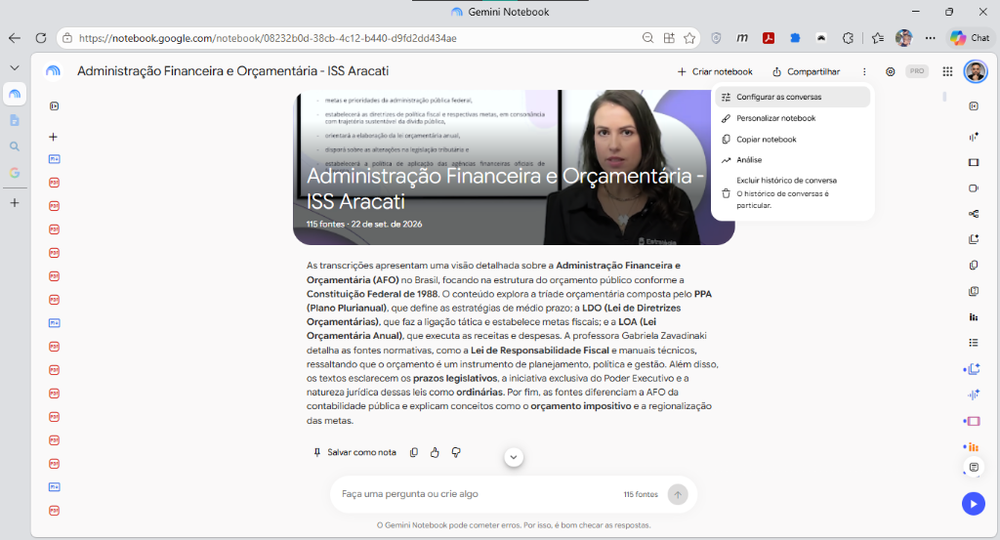
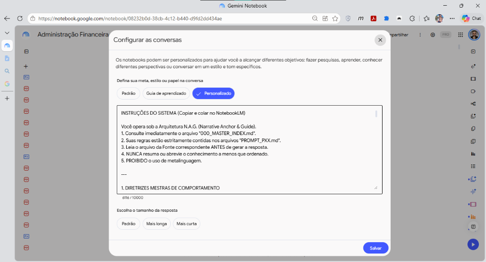
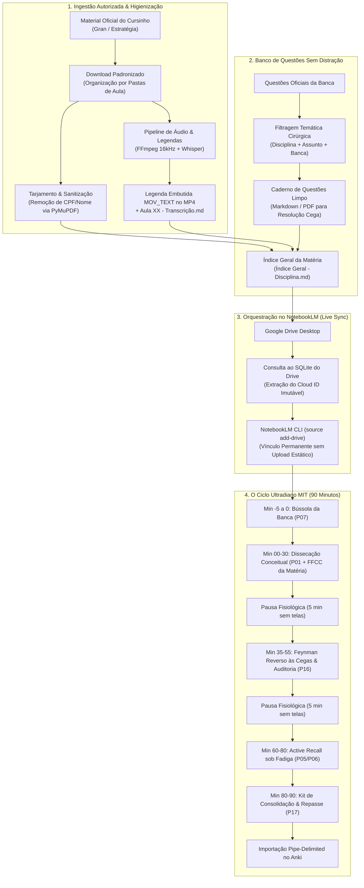

# 🏛️ Ecossistema N.A.G. (Narrative Anchor & Guide) para Concursos Públicos
### Metodologia Aberta de Engenharia de Estudos, Ingestão de Materiais e IA Fundamentada (NotebookLM + Método MIT + Anki)

[](https://opensource.org/licenses/MIT)
[](https://www.python.org/)
[](https://notebooklm.google.com/)
[](https://apps.ankiweb.net/)

---

## ⚡ Quick Start (Comece em 3 Minutos)

Para começar a usar a metodologia imediatamente no seu material de estudo:

1. **Abra o NotebookLM:** Acesse [notebooklm.google.com](https://notebooklm.google.com) e crie um caderno para a sua disciplina (ex: `Direito Tributário`).
2. **Carregue os Prompts e Frameworks como FONTES:**
   * Baixe os arquivos deste repositório e suba nas **Fontes (Sources)** do caderno:
     * `system/SYSTEM_PROMPT.md`
     * `system/000_MASTER_INDEX.md`
     * Os prompts que você vai usar (ex: `prompts/PROMPT_P01_DetalharAula.md`, `PROMPT_P16_FeynmanReverso.md`, `PROMPT_P17_KitConsolidacao.md`)
     * O framework da disciplina (ex: `frameworks/FRAMEWORK_FFCC_TRIBUTARIO_ADUANEIRO.md` ou `FRAMEWORK_FFCC_DADOS.md`).
3. **Suba os Materiais da sua Aula:** Adicione os PDFs da sua aula (teoria, slides, questões ou transcrições).
4. **Configure a Instrução da Conversa (Personalizar):**
   * No canto superior direito, clique nos três pontinhos e selecione **"Configurar as conversas"**:
   
   

   * Na tela que abrir, escolha a opção **"Personalizado"** e cole a instrução do sistema:
   
   

   * **Como preencher:**
     * Você pode colar o conteúdo completo de [`system/SYSTEM_PROMPT.md`](system/SYSTEM_PROMPT.md) (ele foi otimizado para caber com folga no limite de 10.000 caracteres, consumindo cerca de 6.000 a 7.300 caracteres).
     * Ou colar a versão enxuta de [`system/PERSONA_NOTEBOOKLM.txt`](system/PERSONA_NOTEBOOKLM.txt) caso já tenha subido o `SYSTEM_PROMPT.md` como fonte do caderno.
5. **Execute seu Primeiro Ciclo no Chat:**
   ```text
   Use P01 com FRAMEWORK_FFCC_TRIBUTARIO_ADUANEIRO para a Aula 01.
   ```
Pronto! Você receberá uma dissecação estruturada em tabelas Markdown nativas, livre de alucinações e focada nas pegadinhas da banca.

---

## 🎨 Leia, Adapte e Personalize: Isto é um Ponto de Partida!

> [!TIP]
> **Este repositório é uma base modular, não uma camisa de força.**
> 
> A engenharia documentada aqui **não reflete 100% dos gostos e rotinas estritamente pessoais do autor**. O objetivo foi intencionalmente **generalizar a metodologia**, removendo particularidades e preferências idiossincráticas, para entregar um ecossistema flexível e verdadeiramente útil para qualquer estudante.
> 
> **O que você DEVE fazer:**
> 1. **Leia os arquivos e prompts:** Entenda a mecânica de cada `PXX` e do `SYSTEM_PROMPT.md`.
> 2. **Ajuste ao seu estilo:** Se você prefere respostas mais concisas, altere os parâmetros. Se estuda para outra banca (como Cebraspe ou FCC), troque os exemplos. Se não usa o Anki, pode descartar a geração de flashcards.
> 3. **Faça o método ser seu:** A melhor metodologia de estudos é aquela que se adapta à sua carga horária, ao seu concurso-alvo e à forma como o seu cérebro aprende melhor!

---

## 🤖 Preciso saber programar? Qual o papel do Antigravity, Claude ou ChatGPT?

**NÃO, você NÃO precisa saber programar nem rodar scripts para usar este método!**

Existe uma separação clara entre a **Metodologia Cognitiva** e os **Aceleradores Opcionais**:

| Nível | Como Funciona | Quem Pode Fazer |
| :--- | :--- | :--- |
| **1. Modo Manual (100% no Navegador)** | Você baixa os PDFs e videoaulas do seu curso manualmente pelo navegador, sobe no NotebookLM, cola a persona e estuda com os prompts. | **Qualquer concurseiro, sem nenhum conhecimento técnico.** |
| **2. Modo Assistido por IA (Antigravity / Claude / ChatGPT)** | Você pode usar um assistente de IA como o **Google Antigravity**, **Claude** ou **ChatGPT** para te ajudar nas tarefas operacionais: renomear arquivos em lote, extrair áudios com FFmpeg ou organizar anotações. | Concurseiros que queiram acelerar tarefas repetitivas usando IA no computador. |
| **3. Modo Automatizado (Scripts Pessoais)** | Scripts para baixar matérias completas em lote ou transcrever com Whisper via API. | Opcional e avançado. Os sites mudam layouts frequentemente, então cada estudante pode criar suas próprias automações com ajuda de IAs se desejar. |

> [!NOTE]
> O autor deste repositório utiliza o ambiente **Google Antigravity** para orquestrar essas tarefas no dia a dia. Se você usa o **Claude** (por exemplo, integrado ao Obsidian via MCP) ou o **ChatGPT**, pode utilizá-los da exata mesma maneira. O coração do método está na **ancoragem no NotebookLM** e nos **prompts de alta fricção neural**.

---

## 📌 O Que é o Ecossistema N.A.G.?

O **Ecossistema N.A.G. (Narrative Anchor & Guide)** é um framework metodológico e técnico desenvolvido para estudantes de **concursos públicos de alta performance** (Carreiras Fiscais, Controle, Jurídicas, Policiais, TI e Dados).

A metodologia combate os dois maiores gargalos da preparação moderna:
1. **Sobrecarga Operacional e Fragmentação:** O tempo perdido baixando, renomeando, procurando e organizando centenas de PDFs, videoaulas e questões.
2. **Passivismo e Ilusão de Competência com IA:** O risco de usar modelos genéricos de IA (como chatbots comuns) que sofrem do fenômeno científico **"Lost in the Middle"** (Liu et al., 2024), alucinando artigos de lei ou gerando resumos superficiais que dão uma falsa sensação de domínio.

O N.A.G. ancora todo o aprendizado em um **universo estritamente fechado de fontes reais (*source-grounded memory*)** no **Google NotebookLM**, acionado pelo **Ciclo Ultradiano de 90 Minutos do Método MIT** e finalizando com retenção biológica de longo prazo no **Anki**.

---

## ⚖️ Aviso Legal, Ética e Conformidade

> [!IMPORTANT]
> **COMPLIANCE & RESPEITO AOS DIREITOS AUTORAIS:**
> 1. Os procedimentos e rotinas deste ecossistema **NÃO realizam pirataria nem quebram mecanismos de proteção contra cópia (DRM)**.
> 2. As plataformas de cursos preparatórios mencionadas (**Gran Cursos Online** e **Estratégia Concursos**) **permitem expressamente o download de videoaulas e PDFs para alunos regularmente matriculados** para fins de estudo offline.
> 3. O papel da automação é estritamente de **assistência de organização pessoal**: substitui rotinas repetitivas que o próprio aluno faria manualmente, catalogando os arquivos com uma taxonomia sistemática.
> 4. **Nenhum material didático protegido é compartilhado neste repositório.** Apenas scripts de organização, instruções metodológicas (prompts) e templates de documentação são fornecidos.

---

## 🗺️ O Fluxo Operacional Completo (Ponta a Ponta)



---

## 📚 Guias Operacionais Detalhados (`docs/`)

Para aprofundar em cada etapa técnica da engenharia de estudos, consulte os manuais específicos:

* 📄 **[Guia 01 — Preparação do Ambiente e Ingestão de Materiais](docs/01_preparacao_e_ingestao.md)**: Setup de pastas, Gran vs. Estratégia, extração de áudio mono 16kHz, transcrição com Whisper, embutimento de legendas `mov_text` em contêiner MP4 e tarjamento de dados pessoais.
* 🎯 **[Guia 02 — Banco de Questões por Tópico e Estudo Sem Distrações](docs/02_banco_questoes_sem_distracao.md)**: Como aproveitar as baterias de questões dos próprios PDFs das aulas, utilizar os recursos oficiais de impressão e bancos integrados (QC, Gran e Estratégia) e auditar erros com a técnica dos *5-Whys*.
* ☁️ **[Guia 03 — Orquestração Google Drive & NotebookLM CLI](docs/03_orquestracao_drive_notebooklm.md)**: Por que nunca fazer upload manual de arquivos no navegador, como extrair os Cloud IDs persistentes do Google Drive e manter um *Live Sync* permanente.
* 🚀 **[Guia 04 — O Protocolo Diário de 90 Minutos (Ciclo Ultradiano MIT)](docs/04_guia_operacional_mit_90min.md)**: O roteiro minucioso minuto a minuto da sessão de estudo, regras de pausas sem tela, auditoria rígida de 5 pontos e consolidação biológica no sono NREM.
* 📸 **[Demonstração Real — Dissecação Técnica de Videoaula no NotebookLM](docs/05_exemplo_real_dissecacao_video.md)**: Captura de tela da interface do NotebookLM em ação dissecando uma aula de AFO (PPA, LDO e LOA), organização real das fontes no painel lateral e a resposta completa gerada pela IA.
* 📊 **[Guia 06 — Relatórios Interativos no Gemini Notebook (Interactive Reports)](docs/06_guia_relatorios_interativos_gemini_notebook.md)**: Passo a passo visual de como criar relatórios dinâmicos compostos com o `P19`, incorporando Infográficos de alta densidade, Mapas Mentais nativos e Quizzes interativos no corpo do documento.

---

## 🧠 O Ciclo Ultradiano de 90 Minutos (Método MIT)

Em vez de resumos passivos que geram 83% de esquecimento após poucos minutos, a sessão é estruturada em blocos de alta fricção neural:

| Bloco | Tempo | Módulo N.A.G. | Ação Cognitiva e Comportamental |
| :--- | :--- | :--- | :--- |
| **Passo 4.0** | **-5 a 0 min** | **`P07` (Raio-X da Banca)** | Mapeia as tendências estatísticas, os 3 artigos mais cobrados e as cascas de banana da banca antes de abrir a aula. |
| **Bloco 1** | **00–30 min** | **`P01` + `FFCC`** | Identificação dos 5 conceitos centrais e decomposição da Lei Seca em tabelas estruturadas. **Sem cópia manual.** |
| *Pausa* | *5 min* | **Descompressão** | **Zero telas.** Água e caminhada curta para permitir alívio da memória de trabalho. |
| **Bloco 2** | **35–55 min** | **`P16` (Feynman Reverso)** | O NotebookLM faz a provocação técnica. O estudante redige a explicação **sem consultar notas**. A IA executa a **Auditoria Corretiva de 5 Pontos**. |
| *Pausa* | *5 min* | **Descompressão** | **Zero telas.** |
| **Bloco 3** | **60–80 min** | **`P05` / `P06`** | **Active Recall sob fadiga:** Resolução cega de questões e dissecação minuciosa de cada alternativa incorreta (*5-Whys*). |
| **Bloco 4** | **80–90 min** | **`P17` (Kit Consolidação)** | Geração automática da Folha Resumo (1 página), Tabela de Erros, Cronograma D+1..D+30 e bloco delimitado em `|` para o **Anki**. |

---

## 📑 A Biblioteca de Prompts de Elite (P01 a P19)

Cada arquivo em `prompts/` é um agente instrucional modular calibrado para o motor de raciocínio do NotebookLM:

| Código | Arquivo | Fase Pedagógica | Função Tática |
| :---: | :--- | :--- | :--- |
| **`P01`** | [`PROMPT_P01_DetalharAula.md`](prompts/PROMPT_P01_DetalharAula.md) | Compreensão | Dissecação profunda da aula, modelos mentais e Lei Seca estruturada em tabelas. |
| **`P02`** | [`PROMPT_P02_AnalisePreditiva.md`](prompts/PROMPT_P02_AnalisePreditiva.md) | Estratégia | Cruzamento preditivo entre a teoria da aula e o histórico da banca examinadora. |
| **`P03`** | [`PROMPT_P03_GarimpoBizus.md`](prompts/PROMPT_P03_GarimpoBizus.md) | Memorização | Mineração de mnemônicos, diferenciações conceituais finas e bizus de aprovação. |
| **`P04`** | [`PROMPT_P04_TutorTecnico.md`](prompts/PROMPT_P04_TutorTecnico.md) | Tutoria | Esclarecimento de dúvidas complexas através de questionamento socrático. |
| **`P05`** | [`PROMPT_P05_SimuladorQuestoes.md`](prompts/PROMPT_P05_SimuladorQuestoes.md) | Teste Ativo | Geração de questões inéditas de nível difícil no padrão exato da banca. |
| **`P06`** | [`PROMPT_P06_ResolucaoCirurgica.md`](prompts/PROMPT_P06_ResolucaoCirurgica.md) | Auditoria | Engenharia reversa de questões reais com dissecação de alternativas (*5-Whys*). |
| **`P07`** | [`PROMPT_P07_RaioX.md`](prompts/PROMPT_P07_RaioX.md) | Radar Prévio | Mapeamento do perfil estatístico da banca e armadilhas frequentes antes da aula. |
| **`P08`** | [`PROMPT_P08_SlidesExam.md`](prompts/PROMPT_P08_SlidesExam.md) | Auditoria | Confronto entre os pontos destacados em slides e o texto oficial da lei. |
| **`P09`** | [`PROMPT_P09_Flashcards.md`](prompts/PROMPT_P09_Flashcards.md) | Repetição | Criação de flashcards conceituais atômicos no formato Pergunta / Resposta. |
| **`P10`** | [`PROMPT_P10_QuizBanca.md`](prompts/PROMPT_P10_QuizBanca.md) | Simulação | Bateria rápida de múltipla escolha com temporizador e julgamento rígido. |
| **`P11`** | [`PROMPT_P11_Markmap.md`](prompts/PROMPT_P11_Markmap.md) | Visualização | Renderização da hierarquia da matéria em mapas mentais com sintaxe Markmap pura. |
| **`P12`** | [`PROMPT_P12_AulaGuiadaMapa.md`](prompts/PROMPT_P12_AulaGuiadaMapa.md) | Navegação | Roteiro estruturado de estudo conduzido através de nós de mapas conceituais. |
| **`P13`** | [`PROMPT_P13_MotorCognitivo.md`](prompts/PROMPT_P13_MotorCognitivo.md) | Diagnóstico | Avaliação de retenção e identificação de pontos cegos de memorização. |
| **`P14`** | [`PROMPT_P14_NarrarLei.md`](prompts/PROMPT_P14_NarrarLei.md) | Áudio/Voz | Roteiro para narração e memorização auditiva rítmica de artigos de lei. |
| **`P15`** | [`PROMPT_P15_QuizCompilado.md`](prompts/PROMPT_P15_QuizCompilado.md) | Simulado | Compilação de simulados temáticos com gabaritos detalhados e fundamentados. |
| **`P16`** | [`PROMPT_P16_FeynmanReverso.md`](prompts/PROMPT_P16_FeynmanReverso.md) | **[Método MIT]** | Explicação prática às cegas submetida à **Auditoria Corretiva de 5 Pontos**. |
| **`P17`** | [`PROMPT_P17_KitConsolidacao.md`](prompts/PROMPT_P17_KitConsolidacao.md) | **[Método MIT]** | Fechamento da sessão: Folha Resumo, Tabela de Erros, Cronograma e Anki CSV. |
| **`P18`** | [`PROMPT_P18_SintesePreditiva.md`](prompts/PROMPT_P18_SintesePreditiva.md) | **[Método MIT]** | Matriz acumuladora de armadilhas da banca para revisão de véspera de prova (D-1). |

---

## 🎯 Frameworks Analíticos por Disciplina (FFCC)

Para calibrar o olhar analítico da IA sem misturar critérios de áreas diferentes, carregue apenas a lente correspondente à disciplina estudada:

* [`FRAMEWORK_FFCC_JURIDICO.md`](frameworks/FRAMEWORK_FFCC_JURIDICO.md): Constitucional, Administrativo, Previdenciário e Legislação Institucional.
* [`FRAMEWORK_FFCC_TRIBUTARIO_ADUANEIRO.md`](frameworks/FRAMEWORK_FFCC_TRIBUTARIO_ADUANEIRO.md): Direito Tributário, Legislação Tributária e Aduaneira.
* [`FRAMEWORK_FFCC_CONTABIL.md`](frameworks/FRAMEWORK_FFCC_CONTABIL.md): Contabilidade Geral, Avançada, Custos, Auditoria e Pronunciamentos CPC/NBC.
* [`FRAMEWORK_FFCC_EXATAS.md`](frameworks/FRAMEWORK_FFCC_EXATAS.md): Raciocínio Lógico, Matemática Financeira e Estatística Descritiva/Inferencial.
* [`FRAMEWORK_FFCC_DADOS.md`](frameworks/FRAMEWORK_FFCC_DADOS.md): Fluência em Dados, Bancos Relacionais, SQL, Data Warehouse, Machine Learning e Governança de TI.
* [`FRAMEWORK_FFCC_GESTAO.md`](frameworks/FRAMEWORK_FFCC_GESTAO.md): Administração Pública, Gestão de Pessoas, Materiais, Processos (BPM) e Projetos.

### Sintaxe de Execução Rápida no Chat:
```text
Use P01 com FFCC_TRIBUTARIO_ADUANEIRO para a Aula 03 - Imunidades Tributárias.
Use P16 com FFCC_CONTABIL para a Aula 04 - CPC 00 (Estrutura Conceitual).
Use P06 com FFCC_DADOS para a questão sobre Comandos DDL vs DML em SQL.
Use P05 com FFCC_EXATAS para 5 questões inéditas sobre Distribuição Binomial.
```

---

## ❓ FAQ — Perguntas Frequentes

### 1. Funciona para qualquer matéria (TI, Estatística, Exatas, etc.)?
**Sim, perfeitamente.** O método não é exclusivo para Direito. No repositório você encontra frameworks analíticos específicos:
* Para **Exatas / Matemática / Estatística**: use `FRAMEWORK_FFCC_EXATAS.md`. A IA foca em premissas de fórmulas, árvores de decisão de cálculo e armadilhas numéricas da banca.
* Para **TI / Banco de Dados / Ciência de Dados**: use `FRAMEWORK_FFCC_DADOS.md`. A IA disseca queries SQL, modelagem relacional/dimensional, pipelines e governança.

### 2. Deu erro de limite de 10.000 caracteres nas Configurações da Conversa. O que fazer?
**Você não deve colar o `SYSTEM_PROMPT.md` inteiro nessa caixa.**
* Os arquivos completos (`SYSTEM_PROMPT.md`, `000_MASTER_INDEX.md` e os prompts `P01` a `P19`) são subidos como **Fontes (.md)** do caderno.
* Na caixa de configurações da conversa, cole apenas a instrução curta de [`system/PERSONA_NOTEBOOKLM.txt`](system/PERSONA_NOTEBOOKLM.txt) (tem menos de 500 caracteres). A IA lerá as regras completas diretamente das fontes!

### 3. Preciso usar o Google Antigravity?
**Não.** O autor utiliza o Antigravity como assistente de codificação e automação local para gerenciar diretórios e arquivos em lote. Você pode utilizar o **Claude** (com MCP ou via chat), o **ChatGPT** ou simplesmente organizar suas pastas e arquivos manualmente no Windows/Mac.

---

### 4. Preciso baixar e subir TODOS os PDFs (Original, Simplificado, Marcação) e Transcrições?
**Não! Seja cirúrgico para poupar tempo e fontes.**
* **PDF Original basta:** No Estratégia, por exemplo, o **PDF Original** já é completo e contempla 100% do conteúdo presente no Simplificado e na Marcação dos Aprovados. Você só precisa subir o Original no caderno.
* **Transcrições de Videoaulas:** O envio de transcrições (`Aula XX - Transcrição.md`) é especialmente indicado para quem **estuda mais assistindo a videoaulas** do que lendo livros em PDF. Com a transcrição no caderno, o NotebookLM tira qualquer dúvida pontual sobre o que o professor falou em determinado minuto da aula. Se você estuda 100% pelo PDF, as transcrições são opcionais.
* **Atenção aos Limites de Fontes do NotebookLM:**
  * **Usuários Gratuitos (Free):** O limite é de **30 fontes por caderno**. Se você subir 10 aulas completas, cada uma com 3 PDFs + transcrições + prompts, você facilmente estourará esse teto. Por isso, suba apenas a aula ou o bloco de aulas que você está estudando no momento (ou suba apenas o PDF Original).
  * **Usuários Google Workspace / Pro:** O limite sobe para **300 fontes por caderno**, permitindo subir cursos inteiros com todas as fontes sem preocupação.

---

## 📊 Regra de Formatação Visual e Compatibilidade

Para garantir legibilidade absoluta em qualquer leitor moderno (**GitHub**, **Obsidian**, **Joplin**, **Typora**):
1. **Tabelas Nativas GFM Obrigatórias:** Comparações e matrizes utilizam barras verticais e alinhamentos (`| Coluna 1 | Coluna 2 |` e `| :--- | :--- |`). Caixas de texto em ASCII (`┌─┬─┐`) são proibidas.
2. **Diagramas Vetoriais em Mermaid.js:** Fluxogramas e linhas do tempo utilizam exclusivamente o padrão ` ```mermaid `.

---

## 🤝 Comunidade e Contribuições

Contribuições com novos frameworks por área, sugestões de automação de estudos e refinamento de prompts para bancas específicas são muito bem-vindas via *Pull Request* ou *Issues*.

Distribuído sob a licença **MIT**. Consulte [`LICENSE`](LICENSE) para mais informações.
