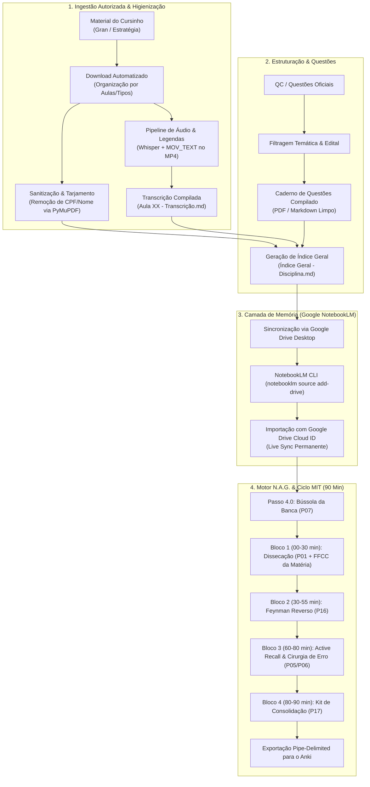

# 🏛️ Ecossistema N.A.G. (Narrative Anchor & Guide) para Concursos Públicos
### Metodologia Aberta de Engenharia de Estudos, Ingestão Automatizada e IA Fundamentada (NotebookLM + Método MIT + Anki)

[](https://opensource.org/licenses/MIT)
[](https://www.python.org/)
[](https://notebooklm.google.com/)
[](https://apps.ankiweb.net/)

---

## 📌 Visão Geral

O **Ecossistema N.A.G. (Narrative Anchor & Guide)** é um framework metodológico e técnico desenvolvido para estudantes de **concursos públicos de alta performance** (Carreiras Fiscais, Controle, Jurídicas e Policiais).

A metodologia resolve os dois maiores gargalos da preparação moderna para concursos:
1. **Sobrecarga Operacional e Fragmentação de Arquivos:** O tempo excessivo gasto baixando, renomeando, procurando e organizando centenas de PDFs, slides, videoaulas e listas de questões.
2. **Passivismo e Ilusão de Competência com IA:** O risco de usar modelos de linguagem genéricos (como ChatGPT puro) que alucinam artigos de lei, geram respostas superficiais ou sofrem de **"Lost in the Middle"** em materiais extensos.

O N.A.G. transforma o material dos cursos em uma **base de conhecimento estritamente ancorada em fontes reais** no **Google NotebookLM**, acionada por uma biblioteca padronizada de prompts cirúrgicos e pelo **Ciclo Ultradiano de 90 Minutos do Método MIT**, finalizando com repetição espaçada no **Anki**.

---

## ⚖️ Aviso Legal, Ética e Conformidade

> [!IMPORTANT]
> **COMPLIANCE & RESPEITO AOS DIREITOS AUTORAIS:**
> 1. Os scripts e procedimentos deste repositório **NÃO realizam pirataria nem quebram mecanismos de proteção contra cópia (DRM)**.
> 2. As plataformas de concurso mencionadas (**Gran Cursos Online** e **Estratégia Concursos**) **permitem expressamente o download de videoaulas e PDFs para alunos regularmente matriculados** para fins de estudo offline.
> 3. O papel da automação é estritamente de **assistência de organização pessoal**: ela apenas automatiza cliques repetitivos que o próprio aluno faria manualmente no navegador, salvando os arquivos com uma taxonomia sistemática e padronizada.
> 4. **Nenhum material didático com direitos autorais é compartilhado neste repositório.** Apenas scripts de organização, arquivos de instrução (prompts) e modelos de documentação são disponibilizados.

---

## 🗺️ Arquitetura do Pipeline (Ponta a Ponta)



---

## 📦 Módulo 1: Ingestão e Organização de Materiais

### 1. Gran Cursos Online vs. Estratégia Concursos
Ambas as plataformas oferecem aos seus assinantes a prerrogativa de download offline de seus conteúdos, mas possuem estruturas complementares:
* **Gran Cursos Online:** Fornece nativamente a **degravação em texto** das aulas e os slides em PDF.
* **Estratégia Concursos:** Fornece materiais escritos excepcionais (PDF Original, Simplificado e Marcação dos Aprovados), mas suas videoaulas **não acompanham transcrições nem legendas completas**.

### 2. O Script de Download Padronizado
Em vez de baixar manualmente 40 a 60 blocos de vídeo e dezenas de PDFs por disciplina, o script:
1. Conecta-se à sessão ativa do aluno na plataforma.
2. Identifica a grade curricular da disciplina.
3. Cria pastas organizadas por aula (`Aula 00`, `Aula 01`, etc.).
4. Padroniza os nomes de arquivo:
   * `Aula XX - Original.pdf`
   * `Aula XX - Simplificado.pdf`
   * `Aula XX - Slides.pdf` (compilado único da aula)
   * `Aula XX - Resumos.pdf`
   * `Aula XX - Mapas Mentais.pdf`

### 3. Pipeline de Transcrição e Embutimento de Legendas
Para resolver a ausência de transcrições no Estratégia:
1. **Extração de Áudio:** O áudio é extraído do MP4 local em formato Mono 16kHz via FFmpeg.
2. **Transcrição em Lote com Whisper:** Transcrição rápida via IA gerando arquivos `.srt` e `.txt`.
3. **Embutimento de Legendas (MOV_TEXT):** As legendas geradas são embutidas diretamente na faixa interna do arquivo `.mp4` (sem re-codificar vídeo, preservando 100% da qualidade original em segundos).
4. **Arquivo de Transcrição em Markdown:** Todas as falas dos vídeos da aula são compiladas em `Aula XX - Transcrição.md`, permitindo busca textual imediata e leitura rápida.

### 4. Tarjamento de Dados Pessoais (Privacidade & Segurança)
Para garantir a privacidade dos dados do titular da conta antes do envio à nuvem, os PDFs passam por um script baseado em `PyMuPDF` que remove visualmente marcas d'água de CPF e Nome registradas na plataforma.

---

## 🎯 Módulo 2: Cadernos de Questões (QConcursos)

A resolução de questões anteriores da banca examinadora (FGV, Cebraspe, FCC) é o alicerce do estudo para concursos:
1. **Mapeamento Pedagógico:** Para cada tópico de aula, são selecionados os filtros correspondentes à banca, cargo, órgão e ano no QConcursos.
2. **Impressão / Compilação em Formato Limpo:** O conjunto de questões resultantes é gerado e compilado em cadernos organizados em PDF e Markdown.
3. **Estudo Sem Distrações:** O concurseiro estuda o caderno impresso ou em leitor digital focado estritamente no enunciado e nas alternativas oficiais de prova, sem interferências externas.

---

## 📑 Módulo 3: Geração Automatizada do Índice Geral

Para cada disciplina, um script sintetizador gera o arquivo `Índice Geral - <Disciplina>.md`, contendo:
* **Mapa do Edital:** Relação completa de todas as aulas teóricas e seu correspondente ponto no edital.
* **Tabela de Videoaulas:** Relação sequencial dos blocos de vídeo, minutagem exata de cada bloco e links locais.
* **Tabela de Acompanhamento:** Colunas para registro de data da primeira leitura, percentual de acertos nas questões e datas de revisões espaçadas.

---

## ☁️ Módulo 4: Sincronização Dinâmica com o Google NotebookLM

O Google NotebookLM é utilizado como a **camada de memória corporificada (*source-grounded memory*)**.

### O Segredo do Google Drive Cloud ID (`add-drive`)
A maioria dos usuários comete o erro de fazer o upload de arquivos arrastando arquivos `.pdf` ou `.md` soltos do computador para a janela web do NotebookLM. 

> [!WARNING]
> **Por que NUNCA fazer upload de arquivos locais soltos?**
> * Arquivos locais enviados pelo navegador tornam-se **cópias estáticas e mortas**.
> * Se você adicionar uma anotação na sua aula, corrigir um resumo ou atualizar o índice, terá que apagar a fonte no NotebookLM e subir tudo de novo, quebrando notas de estudo e consumindo tempo.

### A Solução N.A.G.: Vínculo Permanente com o Google Drive Desktop
1. Os materiais são mantidos na pasta sincronizada do **Google Drive Desktop** (ex: `G:\Meu Drive\...`).
2. O sistema consulta o banco local do DriveFS e obtém o **ID de Nuvem persistente (`cloud_id`)** de cada arquivo.
3. Os arquivos são inseridos no NotebookLM via CLI através do comando:
   ```bash
   notebooklm source add-drive -n <NOTEBOOK_ID> --mime-type pdf <CLOUD_ID> "<Título>"
   ```
4. **Resultado:** As fontes ficam no status `active / ready`. **Qualquer alteração feita no seu arquivo no Google Drive é automaticamente refletida no NotebookLM**, garantindo uma base de conhecimento sempre viva e atualizada!

### Regra de Ouro: Segregação de Cadernos
* **1 Caderno Exclusivo por Matéria:** Nunca misture matérias (ex: `Direito Constitucional` em um caderno, `Contabilidade Geral` em outro).
* **Concursos Federais (ex: Receita Federal):** Inclui-se obrigatoriamente as provas e gabaritos oficiais da banca como fontes de calibração.
* **Concursos Locais (ex: ISS Municipal):** Mantém-se apenas o edital local e as aulas daquela disciplina, sem ruído externo.

---

## 🛡️ Módulo 5: O Motor N.A.G. (Narrative Anchor & Guide)

### O que é a Ancoragem Narrativa?
Quando um modelo de IA analisa dezenas de documentos extensos, ocorre o fenômeno científico **"Lost in the Middle"** (Liu et al., 2024): a atenção da IA se concentra no início e no fim dos documentos, ignorando regras cruciais no meio dos arquivos.

O sistema **N.A.G.** combate esse problema fornecendo:
1. **Âncora Narrativa (*Narrative Anchor*):** Um contrato semântico rígido que proíbe o LLM de utilizar probabilidades soltas da internet, forçando-o a buscar a verdade estrita das fontes inseridas.
2. **Guia Procedimental (*Guide*):** Instruções que direcionam o modelo a percorrer marcos analíticos obrigatórios (decomposição de Lei Seca, verificação de requisitos cumulativos e cascas de banana da banca).

---

## 🧠 Módulo 6: O Ciclo Ultradiano de 90 Minutos (Método MIT)

Baseado nos ritmos biológicos ultradianos e na neurociência da consolidação da memória (Karpicke & Blunt 2011; Receptores NMDA e Sharp-Wave Ripples):

| Bloco | Tempo | Módulo N.A.G. | Ação Cognitiva |
| :--- | :--- | :--- | :--- |
| **Passo 4.0** | **-5 a 0 min** | **P07 (Raio-X da Banca)** | Mapeia o perfil da banca, top 3 artigos mais cobrados e principais armadilhas antes de abrir a aula. |
| **Bloco 1** | **00–30 min** | **P01 + FFCC da Matéria** | Dissecação profunda da teoria, requisitos cumulativos e Lei Seca esquematizada. |
| **Bloco 2** | **30–55 min** | **P16 (Feynman Reverso)** | O NotebookLM lança uma provocação prática extrema. O estudante explica com suas próprias palavras sem consultar. A IA aplica a **Auditoria Corretiva de 5 Pontos**. |
| **Bloco 3** | **60–80 min** | **P05 / P06** | **Active Recall sob fadiga:** Resolução às cegas de questões inéditas ou dissecação minuciosa com a técnica dos *5-Whys*. |
| **Bloco 4** | **80–90 min** | **P17 (Kit de Consolidação)** | Geração da Folha Resumo de 1 página, Tabela de Erros, Cronograma de Repetição e Bloco delimitado em `\|` pronto para importação direta no **Anki**. |

---

## 📚 A Biblioteca de Prompts de Elite (P01 a P18)

Cada arquivo de prompt do ecossistema é uma ferramenta autônoma pronta para uso:

| Código | Nome do Arquivo | Função Tática |
| :--- | :--- | :--- |
| **`P01`** | `PROMPT_P01_DetalharAula.md` | Dissecação exaustiva do conteúdo da aula, modelos mentais e Lei Seca decomposta. |
| **`P02`** | `PROMPT_P02_AnalisePreditiva.md` | Cruzamento preditivo da matéria com as tendências históricas de cobrança da banca. |
| **`P03`** | `PROMPT_P03_GarimpoBizus.md` | Mineração de bizus, mnemônicos e diferenciações conceituais sutis. |
| **`P04`** | `PROMPT_P04_TutorTecnico.md` | Tutoria socrática de aprofundamento para tirar dúvidas de alta complexidade. |
| **`P05`** | `PROMPT_P05_SimuladorQuestoes.md` | Geração de questões inéditas calibradas no estilo e nas pegadinhas da banca examinadora. |
| **`P06`** | `PROMPT_P06_ResolucaoCirurgica.md` | Engenharia reversa de questões reais aplicando a metodologia dos *5-Whys*. |
| **`P07`** | `PROMPT_P07_RaioX.md` | Raio-X estatístico do tema, perfil de cobrança e top pegadinhas. |
| **`P08`** | `PROMPT_P08_SlidesExam.md` | Extração e auditoria dos pontos essenciais contidos nos slides dos professores. |
| **`P09`** | `PROMPT_P09_Flashcards.md` | Criação de flashcards conceituais de alta densidade no padrão pergunta/resposta. |
| **`P10`** | `PROMPT_P10_QuizBanca.md` | Quiz objetivo formatado especificamente no estilo de julgamento da banca. |
| **`P11`** | `PROMPT_P11_Markmap.md` | Renderização visual da estrutura lógica em Mapas Mentais (sintaxe Markmap pura). |
| **`P12`** | `PROMPT_P12_AulaGuiadaMapa.md` | Roteiro guiado de estudo estruturado a partir de ramos mentais hierárquicos. |
| **`P13`** | `PROMPT_P13_MotorCognitivo.md` | Auditoria de retenção e diagnóstico de pontos cegos de memorização. |
| **`P14`** | `PROMPT_P14_NarrarLei.md` | Roteiro de narração e memorização auditiva de dispositivos de Lei Seca. |
| **`P15`** | `PROMPT_P15_QuizCompilado.md` | Compilação de baterias de testes com gabarito fundamentado. |
| **`P16`** | `PROMPT_P16_FeynmanReverso.md` | **[MIT]** Desafio de explicação prática às cegas e auditoria corretiva em 5 pontos. |
| **`P17`** | `PROMPT_P17_KitConsolidacao.md` | **[MIT]** Fechamento de ciclo: Folha Resumo, Tabela de Erros, Cronograma e Anki CSV. |
| **`P18`** | `PROMPT_P18_SintesePreditiva.md` | **[MIT]** Matriz acumuladora de armadilhas da banca e checklist de véspera de prova (D-1). |

---

## 🎯 Frameworks Analíticos por Grande Área (FFCC)

Para que a IA compreenda as particularidades de cada disciplina sem misturar critérios, adicione **apenas o framework correspondente à área da matéria** no caderno do NotebookLM:

* **`FRAMEWORK_FFCC_JURIDICO.md`**: Direito Constitucional, Administrativo, Previdenciário e Legislação de Servidores.
* **`FRAMEWORK_FFCC_TRIBUTARIO_ADUANEIRO.md`**: Direito Tributário, Legislação Tributária, Legislação Aduaneira e Reforma Tributária.
* **`FRAMEWORK_FFCC_CONTABIL.md`**: Contabilidade Geral, Avançada, Custos, Auditoria e Pronunciamentos CPC / NBC TA.
* **`FRAMEWORK_FFCC_EXATAS.md`**: Raciocínio Lógico-Matemático, Matemática Financeira e Estatística.
* **`FRAMEWORK_FFCC_DADOS.md`**: Fluência em Dados, SQL, Data Warehouse, Governança e Inteligência Artificial.
* **`FRAMEWORK_FFCC_GESTAO.md`**: Administração Geral, Pública, Gestão de Materiais, Processos (BPM) e Projetos.

### Sintaxe de Combinação em Duas Camadas:
Ao fazer uma pergunta no chat do NotebookLM, combine o comando operacional com a lente analítica:
```text
Use P01 com FFCC_TRIBUTARIO_ADUANEIRO para a Aula 03 - Valoração Aduaneira.
Use P16 com FFCC_CONTABIL para o CPC 25 (Provisões e Passivos Contingentes).
Use P06 com FFCC_DADOS para a questão sobre Window Functions em SQL.
```

---

## 📊 Regra de Formatação Visual do Ecossistema

Para garantir total compatibilidade com leitores modernos de Markdown (como **Joplin**, **Obsidian**, **Typora**, **MarkText** e o próprio **GitHub**):
1. **Tabelas Nativas GFM Obrigatórias:** Toda comparação ou matriz deve ser renderizada estritamente com barras verticais e hífens (`| Coluna 1 | Coluna 2 |` e `| :--- | :--- |`). É vedado o uso de caixas em blocos de código com caracteres ASCII/box-drawing (`┌─┬─┐`).
2. **Diagramas em Mermaid.js:** Todos os fluxogramas de processos, ciclos operacionais e hierarquias são gerados exclusivamente em blocos ` ```mermaid `, renderizados vetorialmente em qualquer plataforma.

---

## 🚀 Como Estruturar o seu Ambiente

1. Clone ou baixe este repositório.
2. Copie a pasta `prompts/` e os `frameworks/` para uma pasta de referência no seu **Google Drive**.
3. Baixe os seus materiais oficiais do seu cursinho (Gran ou Estratégia) organizando-os em pastas por aula.
4. Crie um caderno temático no **Google NotebookLM** para a sua disciplina (ex: `Direito Administrativo`).
5. Configure o texto do `SYSTEM_PROMPT.md` nas configurações de persona do caderno (`notebooklm configure --persona ...`).
6. Suba os materiais da aula e os arquivos N.A.G. usando o Cloud ID do Drive (`add-drive`).
7. Execute seus ciclos de 90 minutos seguindo o protocolo e envie seus flashcards para o **Anki**!

---

## 🤝 Contribuições e Licença

Contribuições com novos frameworks analíticos, refinamento de prompts para bancas específicas e melhorias na automação são muito bem-vindas via *Pull Request*.

Distribuído sob a licença **MIT**. Consulte `LICENSE` para mais detalhes.
