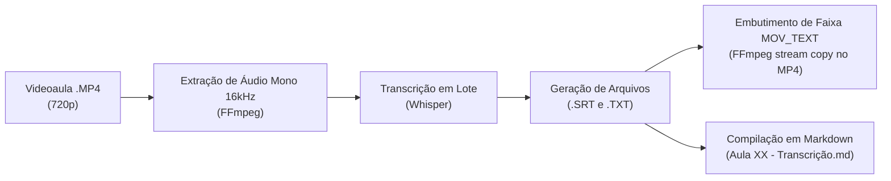

# 📥 Guia 01 — Preparação do Ambiente e Ingestão de Materiais

Este guia descreve o procedimento operacional para transformar materiais brutos das plataformas de concurso em um acervo técnico estruturado, auditado e pronto para ingestão no Google NotebookLM.

---

## ⚖️ Conformidade e Premissas Éticas

1. **Download Oficial Permitido:** Plataformas de referência no mercado brasileiro (**Gran Cursos Online** e **Estratégia Concursos**) autorizam expressamente que alunos matriculados realizem o download offline de PDFs e videoaulas para uso pessoal.
2. **Papel da Automação:** Os scripts de apoio substituem a rotina exaustiva de dezenas de cliques manuais por disciplina, organizando os arquivos por aula e padronizando os nomes conforme taxonomia rigorosa.
3. **Privacidade Absoluta:** O processo inclui rotina de higienização para tarjamento de dados cadastrais (CPF e Nome) em arquivos PDF antes de qualquer sincronização externa.

---

## 🗺️ Fase 0: Setup da Disciplina e Estrutura de Pastas

Para manter a integridade semântica e evitar degradação de contexto (*Lost in the Middle*), adota-se a regra de **um diretório mestre por concurso e subpastas temáticas por disciplina**:

```text
Meu Drive/
└── Concursos/
    └── 2026_SEFAZ_OU_RECEITA/
        ├── Edital_Consolidado.pdf
        ├── Topico_01_Direito_Tributario/
        │   ├── Aula 00/
        │   │   ├── Aula 00 - Original.pdf
        │   │   ├── Aula 00 - Simplificado.pdf
        │   │   ├── 01 - Slides - Conceito de Tributo.pdf
        │   │   ├── 01 - Resumo - Conceito de Tributo.pdf
        │   │   ├── 01 - Video 720p - Conceito de Tributo.mp4
        │   │   ├── 01 - Video 720p - Conceito de Tributo.srt
        │   │   └── 01 - Video 720p - Conceito de Tributo.txt
        │   ├── Aula 00 - Slides.pdf           (Compilado único da Aula 00)
        │   ├── Aula 00 - Resumos.pdf          (Compilado único da Aula 00)
        │   ├── Aula 00 - Mapas Mentais.pdf    (Compilado único da Aula 00)
        │   ├── Aula 00 - Transcricao.md       (Todas as falas dos vídeos da aula)
        │   └── Indice Geral - Direito Tributario.md
        └── Topico_02_Auditoria/
```

---

## 📦 Fase 1: Ingestão por Plataforma

### 1. Gran Cursos Online: Degravação vs. Transcrição
No ecossistema do Gran Cursos Online:
* **Degravação Oficial (PDF):** Síntese redigida pela equipe pedagógica. É concisa, mas frequentemente suprime exemplos orais espontâneos, mnemônicos e avisos de pegadinha ditos pelo professor durante a gravação.
* **Transcrições / Áudio:** Capturam o fluxo integral de fala. São materiais de altíssimo valor semântico para a IA indexar nuances e explicações aprofundadas.
* **Procedimento:** Baixar por aula os PDFs de degravação, slides e arquivos textuais complementares. O índice estruturado da grade é extraído em Markdown para servir de mapa mestre de navegação.

### 2. Estratégia Concursos: Pipeline de Áudio, Whisper e Legendas Embutidas
O Estratégia Concursos fornece excelente material teórico em PDF (Original, Simplificado e Marcação dos Aprovados), mas suas videoaulas **não contam com transcrição textual integral nem legendas incorporadas**.

Para sanar esse gargalo preservando espaço em disco e garantindo acessibilidade e busca rápida:



#### Passo 1: Extração Rápida de Áudio via FFmpeg
O áudio é isolado no padrão ideal para motores de transcrição (16.000 Hz, 1 canal mono, formato leve):
```bash
ffmpeg -y -i "video_aula.mp4" -vn -ar 16000 -ac 1 -c:a libmp3lame -b:a 64k "audio_temp.mp3"
```

#### Passo 2: Transcrição em Lote com Whisper
O arquivo de áudio é submetido ao modelo Whisper, gerando a pontuação gramatical precisa e marcações temporais (*timestamps*), resultando no arquivo de legendas `.srt` e no texto corrido `.txt`.

#### Passo 3: Embutimento Direto no Contêiner MP4 (Sem Re-encode)
Em vez de colar a legenda na imagem (*hardcode subtitling*), o que demora horas e degrada o vídeo, a legenda é inserida como uma nova faixa de texto oculta (*soft subtitle*) usando o codec nativo `mov_text`:
```bash
ffmpeg -y -i "video_aula.mp4" -i "legenda.srt" -c:v copy -c:a copy -c:s mov_text -metadata:s:s:0 language=por "video_aula_legendado.mp4"
```
* **Velocidade:** Executa em menos de 2 segundos por arquivo de 30 minutos.
* **Compatibilidade:** Funciona em qualquer reprodutor moderno (VLC, Windows Media Player, navegadores), permitindo ativar ou desativar a legenda à vontade.

#### Passo 4: Compilação das Transcrições em Markdown
Todas as transcrições dos vídeos de uma aula são unificadas no arquivo:
`Aula XX - Transcrição.md`
Esse arquivo Markdown possui marcadores de minutagem e cabeçalhos claros por bloco de vídeo, sendo uma das fontes mais ricas para perguntas no NotebookLM.

---

## 🔒 Higienização e Tarjamento de Dados Pessoais

Documentos baixados de plataformas de concurso contêm marcas d'água de identificação cadastral (Nome e CPF). Antes de catalogar esses materiais para estudo integrado:

1. Um script baseado em bibliotecas como `PyMuPDF` (`fitz`) realiza a varredura das camadas do PDF.
2. Localiza as coordenadas exatas das marcas d'água de CPF e Nome.
3. Insere tarjas ou higieniza os elementos vetoriais mantendo o texto didático intacto.
4. Salva a versão limpa (`Aula XX - Original.pdf`), garantindo total privacidade e conformidade.
