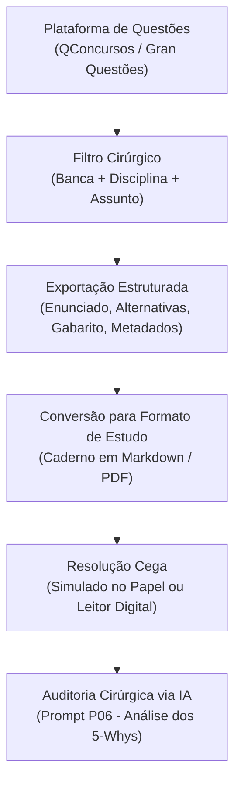

# 🎯 Guia 02 — Banco de Questões por Tópico e Estudo Sem Distrações

A resolução de questões anteriores da banca examinadora (FGV, Cebraspe, FCC, etc.) é o pilar central da preparação para concursos públicos de alto rendimento. Este guia descreve como estruturar um banco de questões limpo, categorizado por tópico do edital, ideal para resolução cega e sem interferências cognitivas.

---

## 🧭 O Princípio da Fricção Cognitiva

A maioria dos candidatos comete um erro fatal ao resolver questões online:
1. Respondem a uma questão no site.
2. Em caso de dúvida ou erro, leem instantaneamente os comentários soltos antes mesmo de pensar.
3. Têm a sensação de aprendizado imediato (**ilusão de competência/fluência**), mas esquecem o motivo do erro na semana seguinte.

**A Abordagem N.A.G.:**
* As questões são filtradas rigorosamente pelo **edital do concurso (Disciplina + Assunto + Banca)**.
* Os blocos de questões são impressos ou compilados em **Markdown/PDF limpos**, contendo apenas **Enunciado e Alternativas**.
* O candidato é forçado a resolver as questões em um bloco contínuo (ex: 15 a 20 questões) em silêncio cognitivo, simulando exatamente o ambiente real de prova.

---

## 🛠️ O Pipeline de Extração e Compilação



---

## 📄 Estrutura Padrão do Caderno de Questões (Markdown)

O arquivo compilado por disciplina (ex: `Banco_Questoes_Direito_Tributario.md`) segue o seguinte formato padronizado:

```markdown
# BANCO DE QUESTÕES: DIREITO TRIBUTÁRIO — CRÉDITO TRIBUTÁRIO
**Banca:** FGV | **Total:** 30 Questões | **Nível:** Superior

---

### Questão 01 (Cód. Q1892341)
**Órgão:** SEFAZ-SP — Auditor Fiscal da Receita Estadual
**Ano:** 2023 | **Dificuldade:** Alta

De acordo com o Código Tributário Nacional (Lei nº 5.172/1966), a suspensão da exigibilidade do crédito tributário:

- A) extingue a obrigação acessória dependente da obrigação principal.
- B) dispensa o cumprimento das obrigações acessórias dependentes da obrigação principal.
- C) não dispensa o cumprimento das obrigações acessórias dependentes da obrigação principal cujo crédito seja objeto da suspensão.
- D) impede a homologação do lançamento por homologação.
- E) impede que a autoridade administrativa realize o lançamento para prevenir a decadência.

<details>
<summary><b>Gabarito Oficial</b></summary>
<b>Resposta: C</b> (Art. 151, parágrafo único, do CTN).
</details>
```

---

## 🔬 Como Usar as Questões no NotebookLM

1. **Ingestão no Caderno da Disciplina:** O arquivo de questões da matéria é carregado como uma das fontes oficiais do caderno.
2. **Resolução de Dúvidas via `P06` (Resolução Cirúrgica):**
   * Ao errar ou hesitar em uma questão, o concurseiro não recorre a respostas genéricas.
   * Invoca no chat:
     ```text
     Use P06 para a Questão Q1892341 do Banco de Questões.
     ```
   * O NotebookLM executa a técnica dos **5-Whys**:
     * Identifica o cerne da cobrança da banca.
     * Disseca por que cada alternativa incorreta é falsa (indicando a pegadinha ou inversão de termos).
     * Aponta o dispositivo literal exato da Lei Seca ou jurisprudência vinculante que fundamenta o gabarito.
