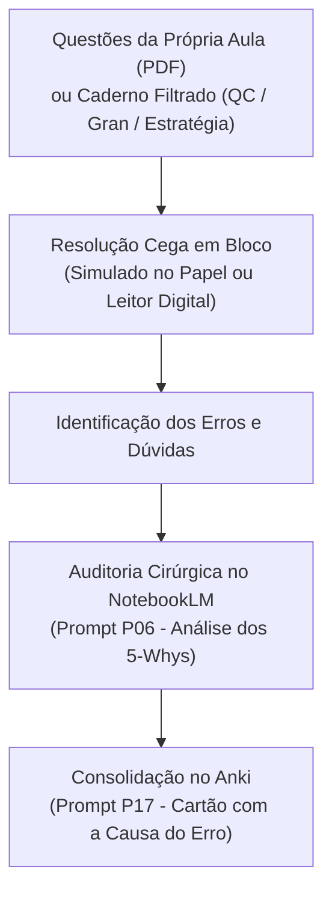

# 🎯 Guia 02 — Banco de Questões por Tópico e Estudo Sem Distrações

A resolução de questões de provas anteriores da banca examinadora (FGV, Cebraspe, FCC, etc.) é o pilar central da preparação para concursos públicos de alto rendimento. Este guia descreve como estruturar um banco de questões limpo, categorizado por tópico do edital, ideal para resolução cega e sem interferências cognitivas.

---

## 1. As Questões dos Próprios PDFs das Aulas (Ponto de Partida Natural)

Antes de procurar qualquer fonte externa de questões, lembre-se: **os próprios PDFs de teoria (Estratégia e Gran) já vêm com uma lista extensa de questões comentadas ao final de cada aula**.

* **Por que isso é tão valioso?**
  * O professor já selecionou as questões mais representativas do tema.
  * Ao subir o PDF da aula no NotebookLM, a IA já tem acesso imediato a essa bateria de questões para traçar o **perfil estatístico de cobrança da banca**, mapear pegadinhas frequentes e entender o DNA do examinador sem que você precise fazer nada a mais.

---

## 2. Fornecendo Mais Questões ao NotebookLM (Filtro Cirúrgico)

Para matérias de peso elevado ou tópicos muito recorrentes, é altamente recomendável complementar o caderno com um volume maior de questões oficiais recentes.

Você pode extrair blocos de questões oficiais utilizando os filtros avançados das plataformas:
* **Filtros Essenciais:** `Disciplina` + `Assunto do Tópico` + `Banca Examinadora` + `Órgão/Cargo` + `Ano Mais Recente`.

### Onde obter e como gerar:
1. **QConcursos (Recurso Oficial de Impressão):**
   * Você pode aplicar os filtros no site do QConcursos, selecionar as questões desejadas e utilizar a função oficial do navegador/site para **"Imprimir / Salvar como PDF"**.
   * Ao gerar o PDF ou caderno impresso, você obtém uma lista limpa para resolver no papel ou leitor digital sem a distração dos comentários imediatos dos fóruns.
2. **Sistemas Integrados de Questões (Estratégia Questões & Gran Questões):**
   * Ambas as plataformas possuem bancos de questões robustos e integrados ao plano do aluno, permitindo filtrar por aula do curso, montar simulados personalizados e exportar cadernos de questões em PDF para resolução offline.

---

## 3. O Princípio da Fricção Cognitiva: Por que Estudar Sem Distrações?

A maioria dos candidatos comete um erro crítico ao resolver questões diretamente na tela:
1. Respondem a uma questão no site.
2. Em caso de dúvida ou erro, abrem imediatamente a aba de comentários antes mesmo de refletir sobre o motivo da falha.
3. Têm a sensação de aprendizado momentâneo (**ilusão de fluência**), mas esquecem a regra na semana seguinte porque não houve esforço neural de recuperação.

**A Abordagem N.A.G.:**
* O concurseiro resolve blocos de 15 a 20 questões em **silêncio cognitivo**, no papel ou em caderno digital limpo, simulando a pressão real do dia da prova.
* Apenas após concluir a bateria, os erros são auditados com profundidade.

---

## 4. O Fluxo de Trabalho com Questões



---

## 5. Como Dissecar os Erros no NotebookLM (`P06`)

Quando você errar ou hesitar em uma questão do seu material, não recorra a explicações rasas. Invoque o `P06` no chat do caderno:

```text
Use P06 para a questão sobre Suspensão da Exigibilidade do Crédito Tributário.
```

O NotebookLM aplica a metodologia dos **5-Whys (Cinco Porquês)**:
1. **Identifica a Causa Raiz do Erro:** Mostra se a falha decorreu de distração na leitura ("pode" vs. "deve"), desconhecimento de prazo literal ou indução por pegadinha da banca.
2. **Dissecação das Alternativas Falsas:** Explica cirurgicamente por que cada item errado é incorreto.
3. **Ancoragem na Lei Seca:** Aponta o artigo de lei exato, súmula vinculante ou jurisprudência que encerra a controvérsia.
