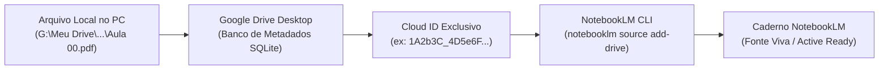

# ☁️ Guia 03 — Orquestração Google Drive & NotebookLM CLI

Este guia ensina como conectar seus materiais didáticos armazenados no **Google Drive Desktop** ao **Google NotebookLM** através de **IDs de Nuvem Persistentes (`cloud_id`)**, criando uma base de conhecimento viva e perfeitamente sincronizada.

---

## ⚠️ A Falácia do Upload Manual no Navegador

Quase todos os estudantes cometem o erro de arrastar arquivos do computador para a interface web do NotebookLM:

| Método | Natureza da Fonte | Atualização de Arquivo | Impacto no Estudo |
| :--- | :--- | :--- | :--- |
| **Arrastar Arquivo Local (Web)** | Cópia estática e morta | Requer apagar a fonte e subir de novo | Perda de tempo, quebra notas antigas e links de citação. |
| **Vínculo via Google Drive (`cloud_id`)** | **Ponte dinâmica viva (Live Sync)** | **Automática** ao editar no Drive | Suas anotações e resumos atualizados refletem instantaneamente no NotebookLM. |

---

## 🏗️ Como Funciona o Vínculo com o Google Drive Desktop

O aplicativo oficial do **Google Drive para Desktop** monta um disco virtual local (ex: `G:\Meu Drive\` ou similar).

Nos bastidores, o Google Drive mantém um banco de metadados SQLite local que mapeia o caminho do arquivo no seu computador para o seu **ID único e imutável na nuvem do Google**.



---

## 💻 Vinculando Fontes via Linha de Comando (CLI)

Com a ferramenta oficial de linha de comando (`notebooklm` CLI):

### 1. Criar o Caderno da Disciplina
```bash
notebooklm create "Direito Tributário - Concurso 2026"
```
O comando retornará o UUID único do seu caderno (ex: `12345678-abcd-ef01-2345-6789abcdef01`).

### 2. Configurar a Persona do Caderno
Aplique as diretrizes comportamentais de elite do ecossistema N.A.G.:
```bash
notebooklm configure -n <NOTEBOOK_ID> --persona "Atue como Tutor Socrático de Elite e Auditor Técnico para Concursos Públicos de Carreiras Fiscais/Controle. Baseie-se estritamente nas fontes fornecidas. Proibido alucinar ou usar probabilidades soltas da internet."
```

### 3. Adicionar Fontes usando o Cloud ID
Obtido o ID de nuvem do arquivo no Google Drive:
```bash
# Para arquivos PDF (Original, Slides, Resumos)
notebooklm source add-drive -n <NOTEBOOK_ID> --mime-type pdf <CLOUD_ID> "Aula 00 - Teoria Completa"

# Para arquivos Markdown ou Texto (Transcrições, Questões, Índices)
notebooklm source add-drive -n <NOTEBOOK_ID> --mime-type text/markdown <CLOUD_ID> "Aula 00 - Transcrição Integral"
```

---

## 🛡️ Regras de Ouro para Gestão de Fontes

1. **Segregação Estrita (1 Caderno por Disciplina):**
   * Nunca crie um "cadernão geral" misturando Direito Constitucional, Contabilidade e Português. Isso dilui a atenção do modelo e provoca alucinações de competência.
2. **Deduplicação Constante:**
   * Nunca mantenha duas versões do mesmo arquivo. Ao lançar uma versão revisada, certifique-se de que a anterior foi substituída.
3. **Limite Seguro de Fontes:**
   * Mantenha entre 15 e 45 fontes de alta qualidade por caderno (PDFs compilados por aula + transcrições completas + caderno de questões + edital consolidado).
