# 🚀 Guia 04 — O Protocolo Diário de 90 Minutos (Ciclo Ultradiano MIT)

Este é o guia de execução prática da unidade fundamental de estudo diário do Ecossistema N.A.G. Ele substitui a leitura passiva e o resumo manual improdutivo por **esforço deliberado, recuperação ativa sob fadiga e consolidação neurobiológica**.

---

## ⏱️ A Linha do Tempo da Sessão (Visão Geral)

```mermaid
gantt
    title Arquitetura da Sessão de 90 Minutos (Método MIT)
    dateFormat  m
    axisFormat %M min

    section Bússola
    Passo 4.0: Raio-X da Banca (P07)             :0, 5
    section Teoria
    Bloco 1: Dissecação de Modelos (P01 + FFCC)   :5, 35
    section Pausa 1
    Pausa Fisiológica (Sem Telas)                 :35, 40
    section Síntese
    Bloco 2: Feynman Reverso & Auditoria (P16)    :40, 65
    section Pausa 2
    Pausa Fisiológica (Sem Telas)                 :65, 70
    section Teste
    Bloco 3: Active Recall sob Fadiga (P05/P06)  :70, 90
    section Fechamento
    Bloco 4: Kit de Consolidação & Anki (P17)     :90, 100
```



---

## 📋 Roteiro de Batalha Passo a Passo

### 🧭 Passo 4.0: A Bússola Prévia da Banca (`P07` — 5 min antes)
Antes de abrir qualquer vídeo ou ler a primeira página do PDF:
1. Abra o caderno no NotebookLM da disciplina.
2. Digite:
   ```text
   Use P07 para a [Aula XX - Tema].
   ```
3. **Ação:** Identifique em 3 minutos quais são os **3 artigos mais cobrados** pela banca e qual é a **armadilha típica** daquele assunto. Isso calibra o seu cérebro para caçar o que realmente cai na prova durante o estudo.

---

### 📖 Bloco 1 (00 a 30 min): Fundamentos & Modelos Mentais (`P01` + `FFCC`)
* **Comando:**
  ```text
  Use P01 com FFCC_[AREA] para a Aula XX.
  ```
* **Objetivo:** O NotebookLM extrai a árvore de decisão lógica, os requisitos cumulativos e a Lei Seca esquematizada em **tabelas nativas GFM**.
* **Regra de Ouro:** **PROIBIDO copiar e colar textos longos em cadernos de resumo.** O foco deste bloco é leitura dinâmica, compreensão dos 5 pilares estruturais e conexão dos conceitos.

☕ *Pausa Fisiológica (5 minutos): Levante-se, beba água e afaste-se 100% de telas. Deixe a memória de trabalho descomprimir.*

---

### 🗣️ Bloco 2 (30 a 55 min): Construção Semântica & Feynman Reverso (`P16`)
Este bloco destrói a "ilusão de competência" (achar que entendeu só porque leu o texto do professor).
1. Digite no chat:
   ```text
   Use P16 para auditar meu domínio sobre [Tema Central da Aula].
   ```
2. O NotebookLM lança uma provocação socrática ou um caso prático espinhoso.
3. **Ação do Estudante:** Sem olhar anotações, slides ou internet, redija (ou dite por voz) uma explicação com suas próprias palavras como se estivesse explicando para alguém inteligente que nunca viu a matéria.
4. Envie sua resposta. O NotebookLM aplica a **Auditoria Rígida de 5 Pontos**:
   * O que está tecnicamente impecável.
   * Onde houve superficialidade ou termos genéricos.
   * Qual exceção ou artigo foi esquecido.
   * Páginas exatas do material para correção.
   * A resposta modelo no nível de um Auditor Fiscal / Analista de topo.

☕ *Pausa Fisiológica (5 minutos): Afaste-se das telas.*

---

### 🧠 Bloco 3 (60 a 80 min): Active Recall sob Fadiga Controlada (`P05` / `P06`)
Com o cérebro entrando na fase de esforço cognitivo elevado:
1. Resolva de 10 a 15 questões do seu banco do QConcursos ou gere questões inéditas com:
   ```text
   Use P05 para gerar 10 questões inéditas de nível difícil da banca [FGV/Cebraspe] sobre a Aula XX.
   ```
2. **Resolução 100% às cegas:** Sem consultar notas.
3. **Em caso de erro ou dúvida:** Invoque imediatamente o `P06` (Resolução Cirúrgica) para dissecar as alternativas incorretas e identificar a causa raiz (*5-Whys*).

---

### 📦 Bloco 4 (80 a 90 min): Kit de Consolidação e Repasse (`P17`)
Nos 10 minutos finais, invoque o `P17` para processar todo o histórico da sessão:
```text
Use P17 para gerar o Kit de Consolidação da sessão de hoje.
```
O NotebookLM entrega automaticamente os 5 produtos:
1. **Folha Resumo de 1 Página:** Apenas os 5 conceitos e o ponto que falhou no Feynman.
2. **Tabela de Erros:** Mapeamento cirúrgico [Erro Cometido vs. Regra Correta vs. Artigo/Súmula].
3. **10 Questões de Revisão Alvo:** Para reteste nos dias subsequentes.
4. **Cronograma de 7 a 30 Dias:** Cadência de repetição espaçada.
5. **Bloco de Flashcards para o Anki:** Cartões atômicos delimitados pelo caractere `|`.

---

## 🗂️ Fase 5: Fechamento no Anki e Repetição Espaçada

1. Copie o bloco de texto gerado no item 5 do `P17`.
2. Abra o **Anki** -> Clique em **Importar Arquivo** -> Selecione o arquivo de texto ou cole com delimitador de campo `|`.
3. Revise seus cartões nos dias agendados.
4. **Higiene do Sono:** Durma bem. A consolidação biológica definitiva das trilhas sinápticas estimuladas nos 90 minutos ocorre no sono profundo (NREM) através dos *Sharp-Wave Ripples* (SPW-R).
---

---

## 🧬 Fundamentação em Ciência Cognitiva: VARK Multimodal, Dupla Codificação e Artefatos do NotebookLM

O **Google NotebookLM (Gemini Notebook)** dispõe de um painel lateral de **Estúdio (Studio)** capaz de transformar as fontes carregadas em múltiplos formatos e artefatos de aprendizado. No **Ecossistema N.A.G.**, esses artefatos não são gerados de forma aleatória: eles são acionados por **Prompts Específicos (P01 a P19)** para atender às diferentes modalidades do modelo **VARK** (Visual, Auditivo, Leitura/Escrita e Cinestésico) e explorar a **Teoria da Dupla Codificação (*Dual Coding Theory*)** da ciência cognitiva.

---

### 🎨 1. Os Artefatos que o NotebookLM Pode Criar no Estúdio

O painel do Estúdio do NotebookLM permite gerar as seguintes categorias principais de artefatos didáticos e de aprendizado ativo:

1. **Audio Overviews (Podcasts de IA em Dueto):** Discussão conversacional em áudio entre dois apresentadores virtuais que sintetizam, debatem e analisam os documentos.
2. **Study Guides (Guias de Estudo & Briefing Docs):** Documento estruturado em texto com perguntas e respostas orientadoras, conceitos principais e roteiro de estudo baseado nas fontes.
3. **Flashcards (Cartões de Memória):** Cartões atômicos de pergunta no verso e resposta na frente, voltados para memorização de termos, prazos e definições.
4. **Quizzes Interativos (Simulados da Banca):** Testes de múltipla escolha com correção automática, pontuação, justificativas fundamentadas nas fontes e campo de dicas (*hints*).
5. **Mind Maps (Mapas Mentais Interativos):** Diagramas ramificados e visuais que organizam a hierarquia e as conexões entre os conceitos.
6. **Infográficos e Tabelas de Dados:** Sínteses visuais contínuas e matrizes comparativas para choque de institutos legais e fórmulas.
7. **Relatórios Interativos (Interactive Reports):** Documentos compostos que integram texto expositivo denso com artefatos sob demanda incorporados no próprio corpo da página.
8. **Apresentações de Slides e Resumos em Vídeo:** Lâminas sequenciais e vídeos narrados para visão de conjunto.

---

### 🔗 2. Matriz de Correlação: Prompts N.A.G. ➔ Artefatos NLM ➔ Modelo VARK

O ecossistema **N.A.G.** conecta os módulos de comando (`PXX`) aos artefatos do NLM e às preferências sensoriais do VARK:

| Modalidade VARK | Artefato do NLM (Estúdio / Chat) | Prompt N.A.G. Correspondente | Função Cognitiva na Sessão de Estudo |
| :--- | :--- | :--- | :--- |
| **👁️ Visual (V)**<br>*(Diagramas, Relações Espaciais, Hierarquias)* | • **Mind Maps**<br>• **Infográficos**<br>• **Slide Decks**<br>• Tabelas de Contraste | **`P11`** (Markmap/Obsidian)<br>**`P08`** (Slides Exam Blueprint)<br>**`P19`** (Relatório Adaptativo)<br>**`P07`** (Raio-X da Banca) | **Mapeamento Macro (Bloco 1):** Construir a estrutura e o "esqueleto mental" antes de ler textos densos, reduzindo a sobrecarga da memória de trabalho. |
| **🎧 Auditivo / Aural (A)**<br>*(Escuta Ativa, Discussão, Narração)* | • **Audio Overview** (Podcasts)<br>• Respostas Narradas<br>• Roteiros de TTS | **`P12`** (Aula Guiada por Mapa)<br>**`P14`** (Narrar Lei Seca via TTS) | **Modo Difuso (Pós-Sessão):** Reforçar a memória auditiva sem esforço de telas durante caminhadas, deslocamentos ou descansos. |
| **📖 Leitura/Escrita (R)**<br>*(Texto Estruturado, Listas, Manuais)* | • **Study Guide**<br>• **Relatórios Interativos**<br>• Folhas Resumo<br>• Tabelas de Erros | **`P01`** (Detalhar Aula)<br>**`P04`** (Tutor Técnico)<br>**`P17`** (Kit - Folha Resumo)<br>**`P18`** (Síntese Preditiva) | **Codificação Semântica (Blocos 1 e 4):** Dissecação exaustiva de regras gerais, requisitos, doutrina e exceções em texto limpo com tabelas GFM. |
| **⚡ Cinestésico (K)**<br>*(Hands-on, Fricção, Teste Ativo)* | • **Flashcards**<br>• **Quizzes Interativos**<br>• Bloco CSV para Anki | **`P05`** (Simulador de Questões)<br>**`P06`** (Resolução Cirúrgica)<br>**`P09`** (Flashcards Atômicos)<br>**`P10`/`P15`** (Quiz no Estúdio)<br>**`P16`** (Feynman Reverso) | **Recuperação Ativa & Fricção (Blocos 2 e 3):** Redigir/ditar sem notas, enfrentar dificuldades desejáveis, resolver questões e treinar repetição espaçada no Anki. |

---

### 🧠 3. Aplicação Prática: O Ciclo Ultradiano Multimodal (90 Minutos)

A ciência cognitiva (estudos de Paivio sobre *Dual Coding Theory* e Sweller sobre *Cognitive Load Theory*) demonstra que rotular um estudante em um único estilo fixo é ineficiente. O cérebro aprende melhor quando aciona o **canal verbal/textual** e o **canal visual/espacial** de forma combinada.

No seu estudo diário com o NotebookLM, você deve estruturar a sessão de 90 minutos integrando os artefatos de forma multimodal:

```text
[Minuto 00–30] Visual (V) + Leitura (R) ➔ P07 (Raio-X) + P01 (Detalhar Aula)
               ↳ Criação do Mind Map no Estúdio e leitura do Fichamento Denso.
    │
    ▼ (Pausa de 5 min sem telas)
[Minuto 30–55] Cinestésico (K) ➔ P16 (Feynman Reverso)
               ↳ Digitação/fala da explicação com as próprias palavras (sem consultar notas).
    │
    ▼ (Pausa de 5 min sem telas)
[Minuto 60–80] Cinestésico (K) ➔ P05 (Simulador) / P10 / P15 (Quizzes no Estúdio)
               ↳ Resolução de testes e questões inéditas sob fadiga controlada.
    │
    ▼
[Minuto 80–90] Leitura (R) + Cinestésico (K) ➔ P17 (Kit de Consolidação)
               ↳ Folha Resumo + Tabela de Erros + Exportação de Flashcards (Anki).
    │
    ▼
[Pós-Sessão]   Auditivo (A) ➔ Audio Overview (Podcast)
               ↳ Escuta passiva durante o descanso para consolidar via modo difuso.
```

Essa alternância de artefatos impede que o cérebro afunde no "descarregamento cognitivo passivo" (*cognitive offloading*) e garante que o conhecimento seja codificado por múltiplos caminhos neurais.
