# 🚀 Guia 04 — O Protocolo Diário de 90 Minutos (Ciclo Ultradiano MIT)

Este é o guia de execução prática da unidade fundamental de estudo diário do Ecossistema N.A.G. Ele substitui a leitura passiva e o resumo manual improdutivo por **esforço deliberado, recuperação ativa sob fadiga e consolidação neurobiológica**.

---

## ⏱️ A Linha do Tempo da Sessão (Visão Geral)

```mermaid
gantt
    title Arquitetura da Sessão de 90 Minutos (Método MIT)
    dateFormat  m
    axisFormat %M min

    section Bússola
    Passo 4.0: Raio-X da Banca (P07)             :0, 5
    section Teoria
    Bloco 1: Dissecação de Modelos (P01 + FFCC)   :5, 35
    section Pausa 1
    Pausa Fisiológica (Sem Telas)                 :35, 40
    section Síntese
    Bloco 2: Feynman Reverso & Auditoria (P16)    :40, 65
    section Pausa 2
    Pausa Fisiológica (Sem Telas)                 :65, 70
    section Teste
    Bloco 3: Active Recall sob Fadiga (P05/P06)  :70, 90
    section Fechamento
    Bloco 4: Kit de Consolidação & Anki (P17)     :90, 100
```



---

## 📋 Roteiro de Batalha Passo a Passo

### 🧭 Passo 4.0: A Bússola Prévia da Banca (`P07` — 5 min antes)
Antes de abrir qualquer vídeo ou ler a primeira página do PDF:
1. Abra o caderno no NotebookLM da disciplina.
2. Digite:
   ```text
   Use P07 para a [Aula XX - Tema].
   ```
3. **Ação:** Identifique em 3 minutos quais são os **3 artigos mais cobrados** pela banca e qual é a **armadilha típica** daquele assunto. Isso calibra o seu cérebro para caçar o que realmente cai na prova durante o estudo.

---

### 📖 Bloco 1 (00 a 30 min): Fundamentos & Modelos Mentais (`P01` + `FFCC`)
* **Comando:**
  ```text
  Use P01 com FFCC_[AREA] para a Aula XX.
  ```
* **Objetivo:** O NotebookLM extrai a árvore de decisão lógica, os requisitos cumulativos e a Lei Seca esquematizada em **tabelas nativas GFM**.
* **Regra de Ouro:** **PROIBIDO copiar e colar textos longos em cadernos de resumo.** O foco deste bloco é leitura dinâmica, compreensão dos 5 pilares estruturais e conexão dos conceitos.

☕ *Pausa Fisiológica (5 minutos): Levante-se, beba água e afaste-se 100% de telas. Deixe a memória de trabalho descomprimir.*

---

### 🗣️ Bloco 2 (30 a 55 min): Construção Semântica & Feynman Reverso (`P16`)
Este bloco destrói a "ilusão de competência" (achar que entendeu só porque leu o texto do professor).
1. Digite no chat:
   ```text
   Use P16 para auditar meu domínio sobre [Tema Central da Aula].
   ```
2. O NotebookLM lança uma provocação socrática ou um caso prático espinhoso.
3. **Ação do Estudante:** Sem olhar anotações, slides ou internet, redija (ou dite por voz) uma explicação com suas próprias palavras como se estivesse explicando para alguém inteligente que nunca viu a matéria.
4. Envie sua resposta. O NotebookLM aplica a **Auditoria Rígida de 5 Pontos**:
   * O que está tecnicamente impecável.
   * Onde houve superficialidade ou termos genéricos.
   * Qual exceção ou artigo foi esquecido.
   * Páginas exatas do material para correção.
   * A resposta modelo no nível de um Auditor Fiscal / Analista de topo.

☕ *Pausa Fisiológica (5 minutos): Afaste-se das telas.*

---

### 🧠 Bloco 3 (60 a 80 min): Active Recall sob Fadiga Controlada (`P05` / `P06`)
Com o cérebro entrando na fase de esforço cognitivo elevado:
1. Resolva de 10 a 15 questões do seu banco do QConcursos ou gere questões inéditas com:
   ```text
   Use P05 para gerar 10 questões inéditas de nível difícil da banca [FGV/Cebraspe] sobre a Aula XX.
   ```
2. **Resolução 100% às cegas:** Sem consultar notas.
3. **Em caso de erro ou dúvida:** Invoque imediatamente o `P06` (Resolução Cirúrgica) para dissecar as alternativas incorretas e identificar a causa raiz (*5-Whys*).

---

### 📦 Bloco 4 (80 a 90 min): Kit de Consolidação e Repasse (`P17`)
Nos 10 minutos finais, invoque o `P17` para processar todo o histórico da sessão:
```text
Use P17 para gerar o Kit de Consolidação da sessão de hoje.
```
O NotebookLM entrega automaticamente os 5 produtos:
1. **Folha Resumo de 1 Página:** Apenas os 5 conceitos e o ponto que falhou no Feynman.
2. **Tabela de Erros:** Mapeamento cirúrgico [Erro Cometido vs. Regra Correta vs. Artigo/Súmula].
3. **10 Questões de Revisão Alvo:** Para reteste nos dias subsequentes.
4. **Cronograma de 7 a 30 Dias:** Cadência de repetição espaçada.
5. **Bloco de Flashcards para o Anki:** Cartões atômicos delimitados pelo caractere `|`.

---

## 🗂️ Fase 5: Fechamento no Anki e Repetição Espaçada

1. Copie o bloco de texto gerado no item 5 do `P17`.
2. Abra o **Anki** -> Clique em **Importar Arquivo** -> Selecione o arquivo de texto ou cole com delimitador de campo `|`.
3. Revise seus cartões nos dias agendados.
4. **Higiene do Sono:** Durma bem. A consolidação biológica definitiva das trilhas sinápticas estimuladas nos 90 minutos ocorre no sono profundo (NREM) através dos *Sharp-Wave Ripples* (SPW-R).
