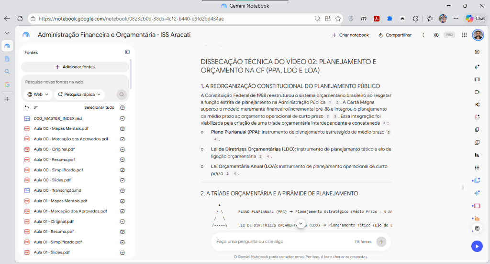

# 🔬 Caso Real de Estudo: Preparação de AFO (ISS Aracati) no NotebookLM

Este documento apresenta um **estudo de caso real** mostrando a esteira completa do **Ecossistema N.A.G.** aplicada na preparação para o concurso de **Auditor Fiscal (ISS Aracati)**, na disciplina de **Administração Financeira e Orçamentária (AFO)**.

---

## 🎯 A Jornada: Da Ingestão à Dissecação Socrática

Para transformar o curso do cursinho em uma base de conhecimento ativa sem sobrecarga cognitiva:

1. **Estruturação por Aulas no Drive:** Os materiais foram organizados por tópicos do edital (`Aula 00`, `Aula 01`, etc.).
2. **Seleção Inteligente de Fontes:** 
   * Subiu-se o **PDF Original** da aula (que já contém a teoria completa e dispensa o Simplificado/Marcação).
   * Os **Slides** foram compilados em um PDF único por aula (`Aula XX - Slides.pdf`).
   * As falas das videoaulas foram transcritas e salvas em Markdown (`Aula XX - Transcrição.md`).
3. **Criação do Caderno e Vínculo via Cloud ID:** O caderno temático foi criado no NotebookLM (`Administração Financeira e Orçamentária - ISS Aracati`) e as fontes foram conectadas diretamente pelo Google Drive Desktop.
4. **Catálogo de Regras:** O arquivo `000_MASTER_INDEX.md` foi adicionado nas fontes para guiar o roteamento dos prompts.

---

## 📸 A Interface em Ação (Caderno Real no NotebookLM)

Abaixo vemos a interface do caderno em produção:



### 📂 Estrutura Real de Fontes no Painel Lateral:
Observe no painel esquerdo a taxonomia padronizada das fontes:
* `000_MASTER_INDEX.md` (Catálogo Geral de Prompts)
* `Aula 00 - Original.pdf` (Teoria Completa)
* `Aula 00 - Slides.pdf` (Compilado de Slides da Aula 00)
* `Aula 00 - Mapas Mentais.pdf`
* `Aula 00 - Transcrição.md` (Transcrições integrais dos blocos de vídeo)
* `Aula 01 - Original.pdf`
* `Aula 01 - Slides.pdf`
* `Aula 01 - Transcrição.md`
* *(e as aulas subsequentes organizadas com a mesma consistência)*

---

## 💬 A Consulta Disparada no Chat

O estudante invocou a análise cirúrgica de um bloco específico de aula:
> *"Disseque tecnicamente o Vídeo 02 sobre Planejamento e Orçamento na CF (PPA, LDO e LOA)."*

---

## 📑 Resposta Técnica Completa Gerada pelo NotebookLM

Abaixo está a resposta na íntegra entregue pelo modelo. Repare no nível de detalhamento: **esquematização visual da tríade, tabela comparativa com prazos e funções constitucionais, dispositivos literais da Lei Seca, jurisprudência do STF, armadilhas típicas da FGV/Cebraspe e resolução das questões da aula com justificativa de cada item**:

# DISSECAÇÃO TÉCNICA DO VÍDEO 02: PLANEJAMENTO E ORÇAMENTO NA CF (PPA, LDO E LOA)

## 1. A REORGANIZAÇÃO CONSTITUCIONAL DO PLANEJAMENTO PÚBLICO

A Constituição Federal de 1988 reestruturou o sistema orçamentário brasileiro ao resgatar a função estrita de planejamento na Administração Pública. A Carta Magna superou o modelo meramente financeiro/incremental pré-88 e integrou o planejamento de médio prazo ao orçamento operacional de curto prazo. Essa integração foi viabilizada pela criação de uma tríade orçamentária interdependente e concatenada:

* **Plano Plurianual (PPA):** Instrumento de planejamento estratégico de médio prazo.
* **Lei de Diretrizes Orçamentárias (LDO):** Instrumento de planejamento tático e elo de ligação orçamentária.
* **Lei Orçamentária Anual (LOA):** Instrumento de planejamento operacional de curto prazo.

---

## 2. A TRÍADE ORÇAMENTÁRIA E A PIRÂMIDE DE PLANEJAMENTO

```
        ▲
       / \       PLANO PLURIANUAL (PPA) ➔ Planejamento Estratégico (Médio Prazo - 4 Anos)
      /   \      
     /-----\     LEI DE DIRETRIZES ORÇAMENTÁRIAS (LDO) ➔ Planejamento Tático (Elo de Ligação)
    /       \    
   /---------\   LEI ORÇAMENTÁRIA ANUAL (LOA) ➔ Planejamento Operacional (Curto Prazo - 1 Ano)
```

| Instrumento | Nível de Planejamento | Alcance Temporal | Conteúdo Central e Função Constitucional |
| :--- | :--- | :--- | :--- |
| **PPA** | Estratégico | **Médio Prazo** (4 anos) | Estabelece, de forma regionalizada, as **diretrizes, objetivos e metas (DOM)** para despesas de capital, outras delas decorrentes e programas de duração continuada. |
| **LDO** | Tático | **Curto/Médio Prazo** (~1,5 ano) | Compreende as **metas e prioridades**, estabelece diretrizes de política fiscal (trajetória da dívida), **orienta a elaboração da LOA**, dispõe sobre alterações tributárias e política de fomento. |
| **LOA** | Operacional | **Curto Prazo** (1 ano civil) | **Prevê as receitas** e **fixa as despesas** para o exercício financeiro (orçamento propriamente dito), englobando o Orçamento Fiscal, da Seguridade Social e de Investimento das Estatais. |

---

## 3. ESQUEMATIZAÇÃO DA LEI SECA DE ALTA DENSIDADE

### A. Competência e Iniciativa das Leis Orçamentárias
* **Dispositivo Legal:** Art. 165, *caput*, e Art. 84, XXIII, da CF/1988.
* **Regra Geral (Caput):** Leis de iniciativa do Poder Executivo estabelecerão o plano plurianual, as diretrizes orçamentárias e os orçamentos anuais. Compete privativamente ao Presidente da República enviar ao Congresso Nacional o PPA, o projeto de LDO e as propostas de orçamento (LOA).
* **Atribuição Rígida (Indelegabilidade):** A iniciativa para propor e enviar os projetos das três leis orçamentárias é **exclusiva e indelegável** do Chefe do Poder Executivo.
* **Vedações Rígidas:** É vedada a avocação da iniciativa pelo Poder Legislativo ou Judiciário. Caso o Poder Legislativo elabore e tramite projeto de lei orçamentária de sua própria iniciativa, haverá inconstitucionalidade formal insanável.

### B. Espécie Normativa e Rito Legislativo
* **Dispositivo Legal:** Art. 165, *caput*, e Art. 166, *caput*, da CF/1988.
* **Regra Geral:** PPA, LDO e LOA são **leis ordinárias** (aprovadas por maioria simples).
* **Disposição sobre a Reserva de Lei Complementar (Art. 165, § 9º, I, CF/88):** A Constituição exige **Lei Complementar** tão somente para dispor sobre *exercício financeiro, vigência, prazos, elaboração e organização* do PPA, da LDO e da LOA. As leis que criam e instituem o PPA, a LDO e a LOA em si **não são leis complementares**, mantendo a natureza jurídica de leis ordinárias.
* **Apreciação Legislativa (Art. 166, CF/88):** Os projetos de lei do PPA, da LDO, da LOA e dos créditos adicionais são apreciados por ambas as Casas do Congresso Nacional (Câmara dos Deputados e Senado Federal) na forma do **Regimento Comum**, com parecer prévio da Comissão Mista Permanente (CMO).

### C. A Regra do Paralelismo Federativo
* **Dispositivo Legal:** Art. 165 da CF/1988 c/c Princípio da Simetria.
* **Regra Geral:** Cada ente federativo (União, Estados, Distrito Federal e Municípios) possui **sua própria tríade de leis orçamentárias** (seu próprio PPA, sua própria LDO e sua própria LOA).
* **Inexistência de PPA Único Nacional:** O PPA aprovado pela União aplica-se estritamente ao âmbito federal, não se impondo automaticamente como plano orçamentário dos Estados e Municípios.
* **Princípio da Simetria Constitucional (STF):** O modelo orçamentário constitucional (PPA, LDO, LOA e o rito de iniciativa do Executivo) é norma de reprodução obrigatória para os Estados, DF e Municípios em suas respectivas Constituições Estaduais e Leis Orgânicas.

---

## 4. ANCORAGEM JURISPRUDENCIAL E DOUTRINÁRIA (STF)

* **Exclusividade da Iniciativa do Executivo (ADI 4.664 / STF):** O Supremo Tribunal Federal fixou o entendimento de que a competência para a iniciativa dos projetos de leis orçamentárias (PPA, LDO e LOA) é **exclusiva e indelegável** do Chefe do Executivo. Embora a CF/88 utilize a expressão "compete privativamente" no art. 84, XXIII, a jurisprudência constitucional veda expressamente a delegação do ato de remessa ou a avocação parlamentar.
* **Hierarquia Material de Planejamento vs. Ausência de Hierarquia Formal:**
  * **Formalmente:** Não existe hierarquia entre leis ordinárias (PPA, LDO e LOA possuem a mesma estatura formal).
  * **Materialmente:** Existe uma **hierarquia de conteúdo no sistema de planejamento**. O PPA condiciona a LDO, e ambos condicionam a LOA. Uma emenda à LDO que for incompatível com o PPA é inconstitucional (Art. 166, § 4º, CF/88). Uma emenda à LOA incompatível com o PPA ou com a LDO é inconstitucional (Art. 166, § 3º, I, CF/88).

---

## 5. DIVERGÊNCIAS, EQUÍVOCOS E PEGADINHAS DE BANCA

| Ponto de Confusão | Erro Induzido pela Banca | Regra Técnica Correta |
| :--- | :--- | :--- |
| **Exigência de Lei Complementar** | Afirmar que PPA, LDO e LOA exigem aprovação por Lei Complementar (maioria absoluta). | **Incorreto.** PPA, LDO e LOA são **leis ordinárias** (maioria simples). Apenas as normas de organização, prazos e vigência exigem Lei Complementar (Art. 165, § 9º). |
| **Vigência do PPA e Mandato** | Afirmar que o PPA coincide perfeitamente com o mandato de 4 anos do Chefe do Executivo. | **Incorreto.** O PPA inicia no **2º ano do mandato** e encerra-se no final do **1º ano do mandato subsequente** (desconexão temporal). |
| **Proporção de Peças Orçamentárias** | Afirmar que a cada PPA correspondem 1 LDO e 1 LOA. | **Incorreto.** Durante a vigência de **1 PPA (4 anos)**, são editadas e executadas **4 LDOs** e **4 LOAs**. |
| **Iniciativa do Processo Legislativo** | Sustentar que o Poder Legislativo pode avocar a elaboração da LOA caso o Executivo atrasar. | **Incorreto.** A iniciativa é **exclusiva e indelegável** do Poder Executivo. |
| **Alcance do PPA Federal** | Afirmar que o PPA Federal vincula e abrange diretamente os orçamentos de Estados e Municípios. | **Incorreto.** Cada ente federado elabora e aprova de forma autônoma o seu próprio PPA, sua LDO e sua LOA. |

```
🚨 ATENÇÃO / PEGADINHA DE PROVA (CEBRASPE / FGV):
A banca adora afirmar que "A LDO estabelece as metas e prioridades da Administração Pública Federal para a vigência do Plano Plurianual". 
ERRO: A LDO tem vigência ANUAL (curto prazo), e suas metas e prioridades são fixadas para o exercício financeiro subsequente, e NÃO para todo o quadriênio do PPA!
```

---

## 6. DISSECAÇÃO DAS QUESTÕES APRESENTADAS NO VÍDEO

### Questão 1 (FGV - Câmara Municipal de São Paulo - Consultor Técnico Legislativo)
**Enunciado:** Avalie as afirmativas sobre os instrumentos de planejamento (PPA, LDO, LOA) na CF/88:
* *Item I:* Uma das principais funções da LDO é estabelecer parâmetros à alocação de recursos na LOA para garantir a realização das metas e objetivos contemplados na LOA.  
  * ❌ **FALSO:** As metas e objetivos garantidos pela alocação da LOA estão contemplados no **PPA**, e não na própria LOA.
* *Item II:* A LDO estima receitas e fixa as despesas para um exercício financeiro.  
  * ❌ **FALSO:** Quem prevê/estima receitas e fixa despesas é a **LOA** (orçamento operacional), e não a LDO.
* *Item III:* O PPA é a peça de mais alta hierarquia dentre a tríade orçamentária, embora esta seja somente constituída de leis ordinárias.  
  * ✅ **VERDADEIRO:** O PPA possui hierarquia material no sistema de planejamento estratégico, embora todas as peças sejam formalmente leis ordinárias.
* *Item IV:* Todas as leis orçamentárias são de iniciativa do Poder Legislativo.  
  * ❌ **FALSO:** São de iniciativa privativa/exclusiva do **Poder Executivo**.
* **Gabarito:** F - F - V - F.

---

### Questão 2 (FGV - Questão Conceitual sobre Rito Legislativo das Leis Orçamentárias)
**Enunciado:** Em celeuma na CCJ da Câmara sobre a exigência de lei complementar para o PPA, LDO e LOA, assinale a opção correta.
* **Análise:** A CF/88 não exige lei complementar para a instituição de PPA, LDO e LOA. Trata-se de matéria reservada a **lei ordinária**, aprovada por maioria simples, embora com tramitação legislativa especial/diferenciada (Regimento Comum do Congresso e parecer da CMO).
* **Gabarito:** A opção correta aponta que o PPA, a LDO e a LOA são leis formal e materialmente ordinárias.
