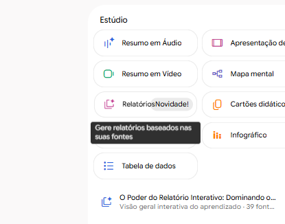
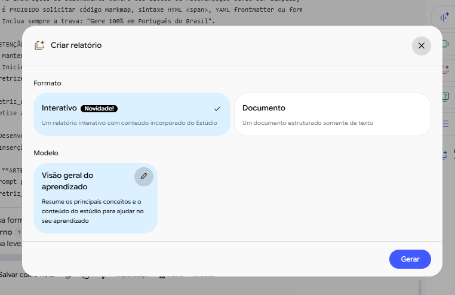
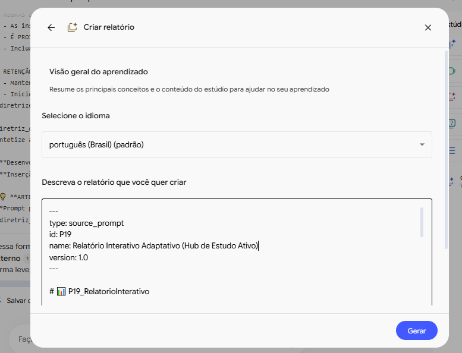
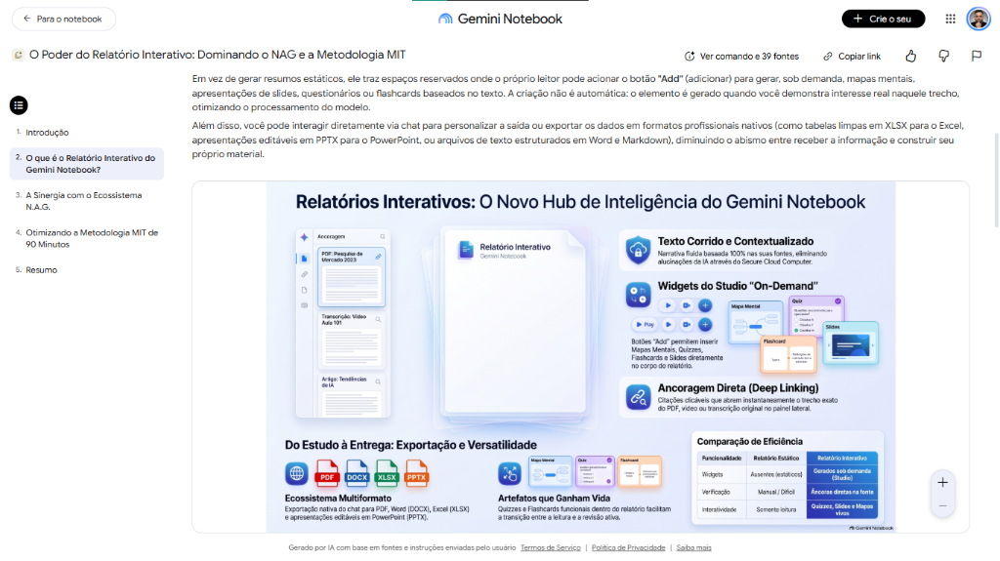
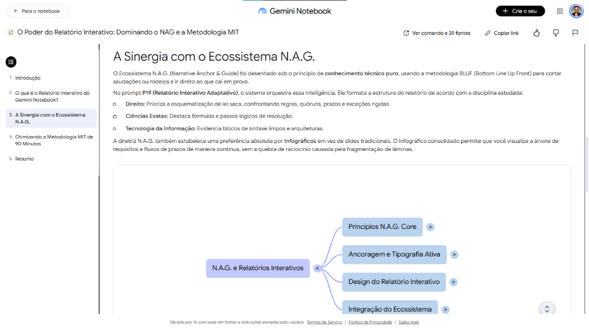
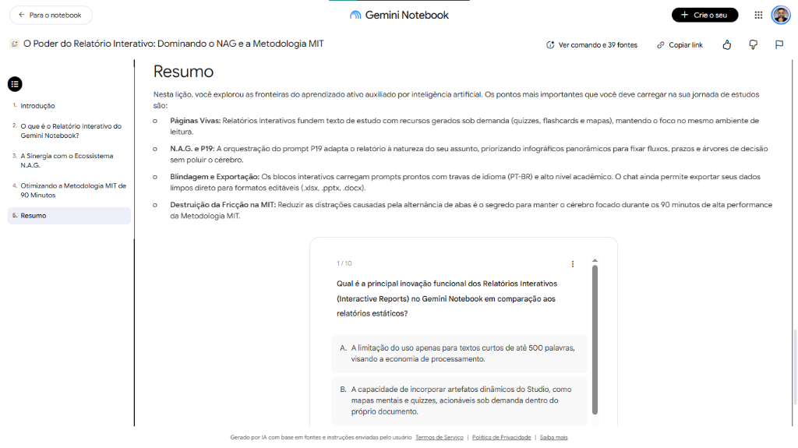

# 📊 Guia 06 — Relatórios Interativos no Gemini Notebook (Interactive Reports)

O **Gemini Notebook (NotebookLM)** introduziu uma evolução estrutural em sua plataforma: os **Relatórios Interativos (*Interactive Reports*)**. Diferente de um resumo estático tradicional em texto corrido ou PDF que você lê passivamente do início ao fim, o Relatório Interativo transforma o material em um **documento vivo, composto e navegável**.

Este guia demonstra como criar relatórios interativos utilizando a inteligência do prompt orquestrador **`P19 (Relatório Interativo Adaptativo)`** do ecossistema N.A.G., priorizando infográficos contínuos de alta densidade e elementos de fixação ativa acionáveis sob demanda.

---

## 1. O que muda no Relatório Interativo?

| Característica | Relatório Estático Tradicional | Relatório Interativo (Gemini Notebook) |
|---|---|---|
| **Formato** | Texto plano, estático e linear | Documento composto (*Composite Document*) com sumário lateral navegável |
| **Recursos do Estúdio** | Separados em abas ou ausentes | **Embutidos diretamente no corpo do texto** (Infográficos, Mapas, Quizzes, Flashcards) |
| **Geração de Artefatos** | Tudo gerado de uma vez (ou nada) | **Sob Demanda (*On-Demand*)**: o leitor aciona os botões *"Add"* apenas onde quiser aprofundar |
| **Ancoragem das Fontes** | Citações soltas de difícil auditoria | **Deep Linking Direto**: clicar na citação abre o PDF/transcrição no trecho exato |
| **Exportação** | Copiar e colar texto | Exportação nativa multiformato (XLSX para Excel, PPTX para PowerPoint, DOCX e PDF) |

---

## 2. Passo a Passo Visual: Como Criar seu Relatório Interativo com o P19

### Passo 1: Localize a Opção no Painel "Estúdio"
No painel lateral do **Estúdio**, localize o botão de ação **Relatórios [Novidade!]**:

---

### Passo 2: Selecione o Formato "Interativo"
No modal de criação que se abrirá:
1. Certifique-se de marcar a opção **Interativo [Novidade!]** (*Um relatório interativo com conteúdo incorporado do Estúdio*).
2. Clique no ícone de lápis ✏️ no card **Visão geral do aprendizado** para customizar as instruções de criação:

---

### Passo 3: Injete a Diretriz do P19 e Defina o Idioma
Na tela de edição das instruções do modelo:
1. Em **Selecione o idioma**, escolha `português (Brasil) (padrão)`.
2. No campo **Descreva o relatório que você quer criar**, cole o conteúdo de [`prompts/PROMPT_P19_RelatorioInterativo.md`](../prompts/PROMPT_P19_RelatorioInterativo.md) (ou especifique: `Aplique a diretriz P19 para o tema [X] da Aula [Y]`).
3. Clique em **Gerar**:

---

## 3. A Anatomia do Relatório Gerado na Prática

Ao concluir a geração, o Gemini Notebook entrega uma página viva com navegação estruturada:

### A. Sumário Lateral e Infográfico Integrado
O relatório traz um sumário interativo à esquerda e incorpora gráficos e esquemas visuais panorâmicos diretamente no fluxo da leitura:

* **Por que a preferência por Infográficos?** Conforme instruído no **P19**, o infográfico entrega em um único plano visual contínuo o fluxo de requisitos, cronologias de prazos e árvores de decisão. Ao contrário de apresentações de slides que fragmentam a linha de raciocínio em lâminas soltas, o infográfico mantém a visão macro e integrada.

---

### B. Mapa Mental Nativo Embutido
Onde houver desdobramentos de órgãos, competências ou hierarquias conceituais, o leitor pode explorar a árvore navegável do **Mapa Mental nativo** diretamente dentro do documento:

---

### C. Avaliação Ativa: Quiz Interativo Incorporado
No fechamento de tópicos críticos ou na seção de resumo, o documento incorpora baterias de **Quiz Interativo** com alternativas clicáveis e verificação imediata:

Isso permite que você saia da postura de leitura passiva e teste sua retenção contra as armadilhas e pegadinhas da banca sem precisar trocar de aba ou abrir outra ferramenta.

---

## 4. Otimização no Ciclo Ultradiano MIT (Sessão de 90 Minutos)

Dentro da **Metodologia MIT**, a maior causa de fadiga cognitiva é a fricção causada pela alternância contínua entre dezenas de abas (uma aba para o PDF, outra para o site de questões, outra para flashcards e outra para anotações).

O Relatório Interativo orquestrado pelo **P19** resolve isso ao centralizar no mesmo ambiente de foco:
1. **Leitura Teórica Densa** (com fundamentação legal e jurisprudencial).
2. **Síntese Visual** (via infográficos panorâmicos contínuos).
3. **Checagem de Retenção** (via quizzes e cartões embutidos).
4. **Auditoria Imediata** (um clique na citação numérica `[X]` abre a página exata da fonte oficial no painel lateral).
