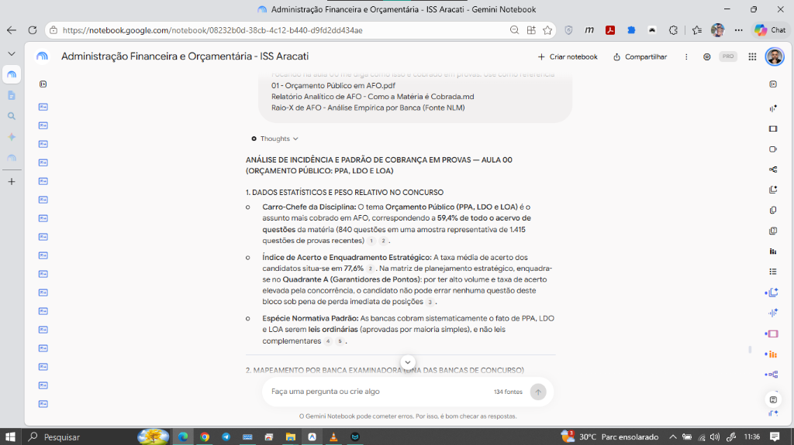

# 🔬 Caso Real: Raio-X de Incidência e DNA da Banca a partir do Acervo de Questões

Este documento apresenta uma **demonstração prática real** de como o **Google NotebookLM** processa e cruza a teoria de uma aula com um **acervo qualificado de questões de concursos anteriores**. 

O caso reproduz uma consulta realizada durante a preparação para o concurso de **Auditor Fiscal (ISS Aracati)**, na disciplina de **Administração Financeira e Orçamentária (AFO)**.

---

## 💡 A Regra de Ouro do Acervo de Questões

> [!IMPORTANT]
> **QUANTO MAIS ROBUSTO E COMPLETO FOR O SEU ACERVO DE QUESTÕES, MAIS CIRÚRGICA SERÁ A RESPOSTA DA IA:**
> 
> O NotebookLM não se baseia em "achismos" ou médias soltas da internet. Ele opera estritamente ancorado nos arquivos fornecidos.
> 
> Quando você alimenta o caderno com um **acervo representativo de questões** (seja extraindo os blocos de questões comentadas dos próprios PDFs teóricos do seu cursinho, seja gerando cadernos direcionados em PDF pelos recursos oficiais do QConcursos, Gran ou Estratégia Questões com filtros de banca, disciplina e ano), a IA consegue:
> 1. **Calcular a Incidência Estatística Real:** Identificar exatamente a porcentagem do tema em relação ao histórico da matéria (ex: *59,4% de todo o acervo de AFO*).
> 2. **Medir a Taxa de Acerto da Concorrência:** Diagnosticar o índice médio de acerto (ex: *77,6%*) e enquadrar o assunto na matriz tática (*Quadrante A - Garantidores de Pontos: proibido errar*).
> 3. **Dissecar o DNA Específico de Cada Banca:** Mostrar como Cebraspe, FGV, FCC e bancas regionais cobram o mesmo artigo de maneiras completamente distintas.

---

## 📸 A Interface em Ação no NotebookLM

Abaixo vemos a tela do caderno em produção no Gemini Notebook, com a consulta disparada e a análise sendo entregue com ancoragem em fontes reais:



---

## 💬 A Consulta Disparada no Chat

O estudante solicitou o cruzamento da **Aula 00** com o banco de dados de questões e relatórios empíricos de provas anteriores:

```text
Focando na Aula 00, me diga como isso é cobrado em provas. Use como referência:
- 01 - Orçamento Público em AFO.pdf
- Relatório Analítico de AFO - Como a Matéria é Cobrada.md
- Raio-X de AFO - Análise Empírica por Banca (Fonte NLM).md
```

*(No padrão N.A.G. de comandos rápidos, essa mesma requisição equivale a: `Use P07 para a Aula 00 cruzando a teoria com o acervo de questões`).*

---

## 📑 Resposta Técnica Completa Entregue pelo NotebookLM

Abaixo está a resposta exata e integral gerada pelo modelo:

# ANÁLISE DE INCIDÊNCIA E PADRÃO DE COBRANÇA EM PROVAS — AULA 00 (ORÇAMENTO PÚBLICO: PPA, LDO E LOA)

### 1. DADOS ESTATÍSTICOS E PESO RELATIVO NO CONCURSO
* **Carro-Chefe da Disciplina:** O tema **Orçamento Público (PPA, LDO e LOA)** é o assunto mais cobrado em AFO, correspondendo a **59,4% de todo o acervo de questões** da matéria (840 questões em uma amostra representativa de 1.415 questões de provas recentes).
* **Índice de Acerto e Enquadramento Estratégico:** A taxa média de acerto dos candidatos situa-se em **77,6%**. Na matriz de planejamento estratégico, enquadra-se no **Quadrante A (Garantidores de Pontos)**: por ter alto volume e taxa de acerto elevada pela concorrência, o candidato não pode errar nenhuma questão deste bloco sob pena de perda imediata de posições.
* **Espécie Normativa Padrão:** As bancas cobram sistematicamente o fato de PPA, LDO e LOA serem **leis ordinárias** (aprovadas por maioria simples), e não leis complementares.

---

### 2. MAPEAMENTO POR BANCA EXAMINADORA (DNA DAS BANCAS DE CONCURSO)

#### A. CESPE / CEBRASPE
* **Foco Principal:** Letra seca dos artigos 165 a 169 da CF/88 combinada com dispositivos da LRF (LC nº 101/2000) e jurisprudência do STF.
* **Modo de Cobrança:** Questões de Certo/Errado exigindo o domínio literal das competências e vedações orçamentárias:
  * Exige a diferenciação precisa entre as funções de cada peça.
  * Explora a desconexão temporal do PPA (vigência de 4 anos iniciando no 2º ano do mandato).
  * Explora a obrigatoriedade do Anexo de Metas Fiscais e do Anexo de Riscos Fiscais na LDO.
* **Pegadinha Clássica:** Trocar atribuições do Anexo de Metas Fiscais (parâmetros e metas anuais de receitas/despesas/dívida) pelo Anexo de Riscos Fiscais (passivos contingentes), ou afirmar que o PPA é dispensado pela LOA no primeiro ano.

#### B. FGV (Fundação Getulio Vargas)
* **Foco Principal:** **Estudos de caso hipotéticos e situações práticas operacionais**.
* **Modo de Cobrança:** Narrativas longas apresentando prefeitos, governadores ou secretários municipais/estaduais em dilemas de planejamento:
  * Teste de compatibilidade entre as leis: emenda à LDO exige compatibilidade única com o PPA; emenda à LOA exige compatibilidade simultânea com o PPA e a LDO.
  * Situações de perda de prazo no envio de propostas orçamentárias por Poderes autônomos (Judiciário/MP), ativando a consolidação pelo Executivo com base na LOA vigente ajustada pela LDO (art. 99, § 4º da CF).
* **Pegadinha Clássica:** Inverter a hierarquia material, afirmando que a LDO pode modificar diretrizes do PPA em elaboração no mesmo exercício.

#### C. FCC (Fundação Carlos Chagas)
* **Foco Principal:** Literalidade constitucional estrita, classificação das estatais na LOA e detalhamento das exceções aos princípios.
* **Modo de Cobrança:** Cobrança detalhada sobre a tripartição orçamentária da LOA (art. 165, § 5º):
  * Alocação de **empresas estatais dependentes** no Orçamento Fiscal ou da Seguridade Social, reservando o Orçamento de Investimento **exclusivamente para as estatais não dependentes**.
  * Exigência literal da função do Orçamento Fiscal e do Orçamento de Investimento de **reduzir as desigualdades inter-regionais** segundo o critério populacional (art. 165, § 7º).

#### D. BANCAS DIVERSAS (IDECAN, VUNESP, FUNDATEC, INSTITUTO AOCP, LEGALLE)
* **Foco Principal:** Mapeamento de termos correlatos e tabela de associação direta de funções.
* **Regra de Decodificação em Provas:**
  * Falou em *"Diretrizes, Objetivos e Metas (DOM)"*, *"Regionalizado"*, *"Despesas de Capital"* e *"4 anos"* $\rightarrow$ **Plano Plurianual (PPA)**.
  * Falou em *"Metas e Prioridades"*, *"Orienta a LOA"*, *"Elo de Ligação"*, *"Alterações na Legislação Tributária"* e *"Anexo de Metas/Riscos Fiscais"* $\rightarrow$ **Lei de Diretrizes Orçamentárias (LDO)**.
  * Falou em *"Estima Receitas e Fixa Despesas"*, *"Exercício Financeiro (1 ano)"*, *"Orçamento Fiscal, Seguridade e Investimento"* e *"Exclusividade"* $\rightarrow$ **Lei Orçamentária Anual (LOA)**.

---

### 3. AS 6 ARMADILHAS/PEGADINHAS MAIS FREQUENTES DAS BANCAS

| Armadilha | O Erro Induzido pela Banca nas Questões | A Regra Técnica Correta |
| :--- | :--- | :--- |
| **1. Troca de Funções das Peças** | Afirmar que a LDO fixa despesas, ou que o PPA estima receitas, ou que a LOA define objetivos regionais de 4 anos. | PPA planeja (DOM / 4 anos); LDO orienta e define metas anuais; LOA estima receita e fixa despesa anual. |
| **2. Reserva de Lei Complementar** | Afirmar que PPA, LDO e LOA são aprovados por Lei Complementar (maioria absoluta). | PPA, LDO e LOA são **leis ordinárias** (maioria simples). Apenas as normas gerais de prazos e vigência do art. 165, § 9º exigem LC. |
| **3. Enquadramento de Estatais na LOA** | Incluir todas as empresas estatais no Orçamento de Investimento das Estatais. | Estatais **dependentes** integram o **Orçamento Fiscal ou da Seguridade Social**. O Orçamento de Investimento é restrito às estatais **não dependentes**. |
| **4. Redução de Desigualdades (Art. 165, § 7º)** | Afirmar que o Orçamento da Seguridade Social tem a função de reduzir desigualdades inter-regionais. | A função de reduzir desigualdades inter-regionais cabe **exclusivamente ao Orçamento Fiscal e ao Orçamento de Investimento**. |
| **5. Exceções à Exclusividade (Art. 165, § 8º)** | Afirmar que a LOA pode conter autorização para abertura de "créditos especiais" ou "créditos extraordinários". | A ressalva constitucional autoriza **apenas créditos suplementares** e **contratação de operações de crédito (inclusive ARO)**. |
| **6. Troca de Anexos da LRF na LDO** | Afirmar que o Anexo de Riscos Fiscais fixa as metas anuais de resultado primário e dívida pública. | **Metas anuais** (receitas, despesas, primário, nominal e dívida) constam no **Anexo de Metas Fiscais**. Riscos e passivos contingentes constam no **Anexo de Riscos Fiscais**. |

---

### 4. MATRIZ SÍNTESE PARA RESOLUÇÃO RÁPIDA DE QUESTÕES

* **PPA** $\rightarrow$ **P-L-A-N-E-J-A** $\rightarrow$ D-O-M (Diretrizes, Objetivos, Metas) \| 4 Anos \| Despesas de Capital e Continuadas.
* **LDO** $\rightarrow$ **L-I-G-A** $\rightarrow$ M-P (Metas e Prioridades) \| Orienta a LOA \| Regra do Recesso (17/07).
* **LOA** $\rightarrow$ **E-X-E-C-U-T-A** $\rightarrow$ Estima Receita / Fixa Despesa \| 1 Ano \| Tripartição (Fiscal, Seguridade, Investimento).

* **Regra de Ouro dos Investimentos Plurianuais (Art. 167, § 1º):** Nenhum investimento cuja execução ultrapasse um exercício financeiro pode ser iniciado sem prévia inclusão no PPA (ou lei que autorize), sob pena de **crime de responsabilidade**.
* **Regra de Ouro do Recesso Parlamentar (Art. 57, § 2º):** A sessão legislativa de julho **não será interrompida** sem a aprovação do projeto de **LDO** (a vedação não se aplica ao PPA nem à LOA).
