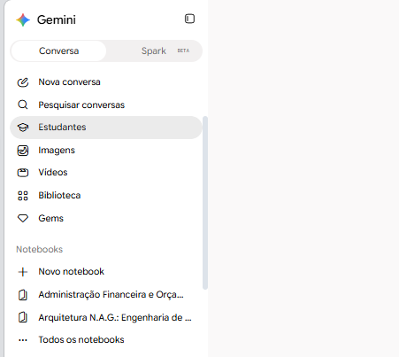
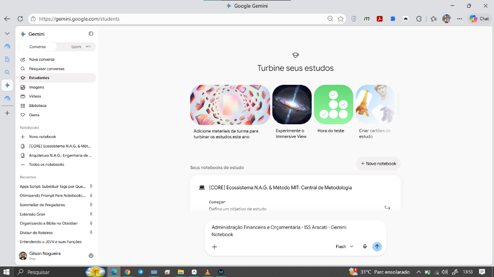
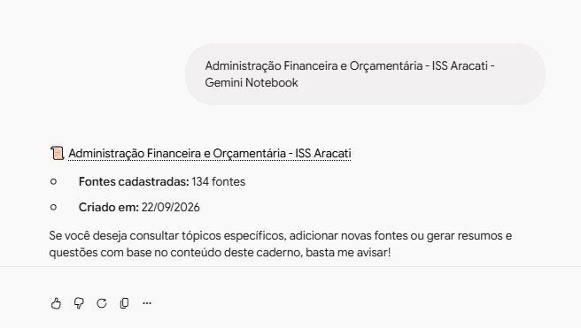

# 🔬 Guia 08 — Fundamentação Científica (VARK & Neurociência) e a Nova Fronteira: Gemini Estudantes

Este manual consolida os dois pilares mais avançados do **Ecossistema N.A.G.**:
1. **A Fundamentação Acadêmica e Científica:** O respaldo em psicologia cognitiva, neurobiologia da memória e literatura de Large Language Models que comprova a superioridade das metodologias ativas.
2. **A Integração com o Google Gemini (Aba Estudantes / *Guided Learning*):** Como utilizar a nova interface do Gemini para conectar seus cadernos do NotebookLM ao **Canvas** e ao **Deep Research**.

---

# PARTE 1: Fundamentação Científica e Catálogo Bibliográfico

O Ecossistema N.A.G. apoia-se em literatura científica revisada por pares (*peer-reviewed*), integrando quatro grandes campos do conhecimento:

```
                                ARQUITETURA CIENTÍFICA N.A.G.
 ┌───────────────────────────┬───────────────────────────┬───────────────────────────┐
 │   CIÊNCIA COGNITIVA &     │    METODOLOGIAS ATIVAS &  │    ENGENHARIA DE LLMS &   │
 │       NEUROBIOLOGIA       │      RECUPERAÇÃO ATIVA    │     SOURCE GROUNDING      │
 ├───────────────────────────┼───────────────────────────┼───────────────────────────┤
 │ • Dupla Codificação       │ • Retrieval Practice      │ • Lost in the Middle      │
 │   (Paivio; Cuevas, 2020)  │   (Karpicke & Blunt, 2011)│   (Liu et al., 2024)      │
 │ • Carga Cognitiva         │ • Dificuldades Desejáveis │ • Source-Grounded AI      │
 │   (Sweller; MDPI, 2026)   │   (Robert Bjork, 1994)    │   (Google Research)       │
 │ • Ritmos Ultradianos      │ • Efeito Protégé / Feynman│ • Anti-Cognitive          │
 │   (Nathaniel Kleitman)    │   (ModelThinkers, 2024)   │   Offloading (MDPI, 2026) │
 └───────────────────────────┴───────────────────────────┴───────────────────────────┘
```

---

## 1. Ciência Cognitiva e Neurobiologia da Memória

### A. Teoria da Dupla Codificação (*Dual Coding Theory*)
* **Base Teórica:** Paivio, A. (1986). *Mental Representations: A Dual Coding Approach*. Oxford University Press.
* **Evidência Atual:** Cuevas, J., & Dawson, B. L. (2020). *Learning styles versus dual coding: which is better for retention?*. Chartered College of Teaching.
* **Mecanismo:** A memória de trabalho dispõe de canais paralelos e independentes: o canal **visuoespacial** (córtex occipital e parietal) e o canal **verbal/semântico** (áreas de Broca e Wernicke). 
* **Aplicação no N.A.G.:** O cérebro não aprende de forma isolada por um "estilo fixo". Ao combinar a leitura estruturada do **`P01`** com a visualização espacial de **Infográficos** e **Mapas Mentais (`P11`)**, o concurseiro ativa ambos os processadores, duplicando os pontos de fixação sináptica sem elevar a fadiga mental.

### B. Teoria da Carga Cognitiva (*Cognitive Load Theory*)
* **Base Teórica:** Sweller, J. (1988). *Cognitive load during problem solving: Effects on learning*. Cognitive Science.
* **Artigo Recente:** *Cognitive Load Theory in the AI Classroom: A Practical Guide for Educators* (EDodo, 2026) e *Cognitive Load Theory-Informed Curriculum Design* (MDPI, 2026).
* **Mecanismo:** Textos corridos monotemáticos de 150 páginas sobrecarregam a memória de trabalho com carga extrínseca inútil. O N.A.G. usa tabelas Markdown nativas (| Coluna |) e blocos atômicos para direcionar 100% da energia mental para a carga germânica (compreensão profunda da regra e suas exceções).

### C. Ritmos Ultradianos e Janela Biológica de 90 Minutos
* **Base Teórica:** Kleitman, N. (1963). *Sleep and Wakefulness*. University of Chicago Press.
* **Artigo:** *Ritmos Ultradianos: Los Ciclos Naturales de 90 Minutos de Tu Cerebro* (Pomodorian, 2026).
* **Mecanismo:** O cérebro opera em ciclos biológicos ultradianos (*Basic Rest-Activity Cycle - BRAC*) de 90 minutos de alerta ótimo, seguidos por vales fisiológicos. As pausas sem tela e a divisão em blocos do Método MIT respeitam exatamente essa arquitetura orgânica.

### D. Consolidação no Sono NREM (*Sharp-Wave Ripples*)
* **Base Teórica:** *Sharp-Wave Ripples in Memory Replay* (Frontiers in Cellular Neuroscience / PubMed).
* **Mecanismo:** O aprendizado de alta densidade estimula receptores NMDA no hipocampo. A transferência definitiva para o córtex cerebral de longo prazo ocorre exclusivamente durante o sono profundo (*Slow-Wave Sleep*), reforçando a necessidade da higiene do sono preconizada no protocolo.

---

## 2. Metodologias Ativas e Prática de Resgate

### A. Prática de Recuperação Ativa (*Retrieval Practice*)
* **Estudo Fundacional:** Karpicke, J. D., & Blunt, J. R. (2011). *Retrieval Practice Produces More Learning than Elaborative Studying with Concept Mapping*. **Science**, 331(6018), 772-775.
* **Mecanismo:** O experimento publicado na revista *Science* comprovou que o ato de **tentar resgatar uma informação da memória** produz até 50% mais retenção do que releituras passivas ou grifos repetitivos. Isso fundamenta a obrigatoriedade dos testes às cegas no Bloco 3 e o uso do Anki.

### B. Dificuldades Desejáveis (*Desirable Difficulties*)
* **Base Teórica:** Bjork, R. A. (1994). *Memory and metamemory considerations in the training of human beings*.
* **Artigo:** *Desirable Difficulties: Learning for Long-Term Retention* (Psychology Fanatic, 2026).
* **Mecanismo:** Facilitar o aprendizado causa a **ilusão de competência**. Quanto maior o esforço cognitivo exigido no momento do estudo (como redigir um conceito sem olhar as notas com o **`P16`**), maior e mais duradouro será o traço de memória.

### C. Técnica de Feynman e o Efeito Protégé
* **Artigos:** *The Feynman Technique: How to Learn Anything Deeply* (Notesmakr) e *Why Teaching is The Brain's Ultimate Hack* (Growth Engineering).
* **Mecanismo:** Ensinar o conceito sem jargões e submeter-se à auditoria de lacunas cognitivas. Base de execução do **`P16 (Feynman Reverso)`**.

---

## 3. Engenharia de LLMs e Prevenção de Alucinações

### A. O Fenômeno "Lost in the Middle"
* **Artigo Científico:** Liu, N. F., Lin, K., Hewitt, J., Paranjape, A., Bevilacqua, M., Petroni, F., & Liang, P. (2024). *Lost in the Middle: How Language Models Use Long Contexts*. **Transactions of the Association for Computational Linguistics (TACL)**.
* **Mecanismo:** LLMs padrão costumam ignorar informações localizadas no meio de contextos longos. O Google NotebookLM supera essa fraqueza ao operar com embeddings vetoriais estritos ancorados em fragmentos de fontes reais com citações auditáveis `[1]`, `[2]`.

### B. Combate ao Descarregamento Cognitivo (*Anti-Cognitive Offloading*)
* **Artigo Científico:** *When Thinking Is Outsourced: Cognitive Offloading and Critical Thinking Among University Students Using Generative AI* (MDPI, 2026).
* **Mecanismo:** Se a IA faz todo o raciocínio pelo estudante, a retenção é zero. O N.A.G. inverte o papel da IA: ela atua como **treinadora socrática rígida** e **auditora de falhas**, exigindo que o cérebro do candidato execute o trabalho pesado.

### C. Orquestração Programática e Pipelines de Terminal (`notebooklm-py`)
* **Biblioteca Open-Source:** [`teng-lin/notebooklm-py`](https://github.com/teng-lin/notebooklm-py) por Teng Lin.
* **Mecanismo:** Viabiliza a orquestração programática via linha de comando (`notebooklm ask`, `metadata`, `source list`), alimentando cadernos automaticamente com acervos de questões e videoaulas, extraindo notas estruturadas e integrando agentes inteligentes sem depender unicamente de cliques manuais na web.

---

# PARTE 2: A Nova Fronteira — Google Gemini Estudantes (`gemini.google.com/students`)

A mais recente atualização do Google integrou nativamente o **NotebookLM** ao **Google Gemini**, criando uma aba dedicada para estudantes:

---

## 1. O Menu Lateral e os Notebooks Integrados

No menu lateral do Gemini, a aba **"Estudantes"** (*Guided Learning*) concentra o ambiente de alta performance acadêmica:



* Diretamente no menu lateral, a seção **"Notebooks"** lista seus cadernos ativos criados no NotebookLM (como `Administração Financeira e Orçamentária - ISS Aracati` e `[CORE] Ecossistema N.A.G.`).

---

## 2. A Central de Estudos no Gemini (`gemini.google.com/students`)

Ao acessar a tela principal de Estudantes, o Gemini oferece ferramentas de aceleração cognitiva nativas:



* **Seus Notebooks de Estudo:** Os cadernos carregados no NotebookLM ficam disponíveis com um card interativo para início imediato.
* **Widgets Nativos:** Atalhos para *"Hora do teste"* (quizzes adaptativos), *"Criar cartões de estudo"* e *"Experimente o Immersive View"*.

---

## 3. Conexão Direta: O Caderno Anexado na Barra de Chat

Na barra de prompts do Gemini, você pode anexar o caderno inteiro com um clique:



O Gemini confirma a ingestão das fontes:
> *"📜 Administração Financeira e Orçamentária - ISS Aracati  
> • Fontes cadastradas: 134 fontes  
> • Criado em: 22/09/2026"*

---

## 4. Como Operar na Arquitetura de Duas Camadas

Essa sinergia cria uma divisão de trabalho perfeita:

| Camada | Ferramenta | Responsabilidade no Estudo |
|---|---|---|
| **Camada 1: Memória Blindada** | **Google NotebookLM** | Universo fechado com suas 134 fontes locais (PDFs do Estratégia, transcrições e banco de questões). Zero alucinação, 100% de precisão. |
| **Camada 2: Motor de Ação & Execução** | **Google Gemini (Aba Estudantes)** | **Canvas Lado a Lado** para redação e folhas resumo em tempo real; **Deep Research** para buscar jurisprudências do STF/STJ pós-edital na internet aberta cruzando com o caderno. |
